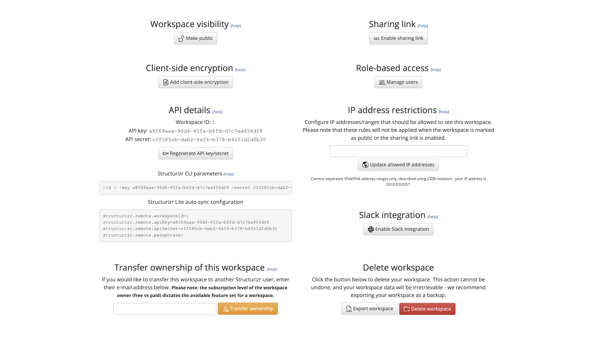

# Workspace settings

Click the "Settings" link from the workspace summary page, to manage the settings for your workspace.
Depending on your role-based access level to the workspace, this page will provide a summary of the workspace,
the API key/secret pair, the number of users who have access, etc.

As the owner of a workspace (the user who originally created it), you have the ability to make your workspaces public or private,
regenerate the API key/secret pair, delete the workspace, and manage the list of users who have access to the workspace.
Users with other levels of role-based access (admin, read-write and read-only) will see different details and/or buttons as appropriate.