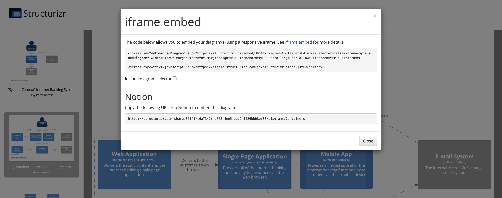

# Notion

The live versions of your architecture diagrams can be embedded into Notion via an iframe. To do this:

- Enable the sharing link for your workspace.
- When viewing a diagram, click the  button to display the URL that you can use to embed that diagram.

## Notes

- This is a paid cloud service feature.