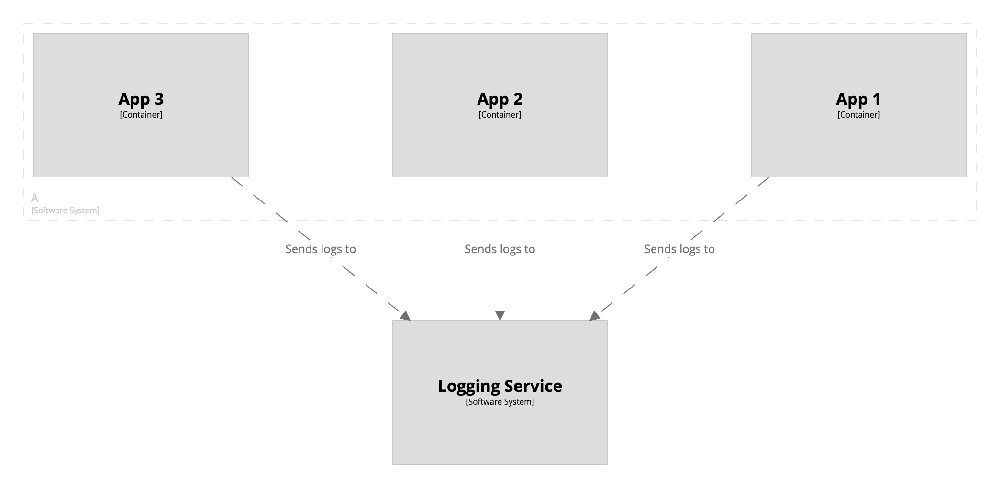

# Bulk operations - elements

The `!elements` keyword can be used to find a set of elements via an [element expression](/dsl/expressions#element-expressions)
in order to perform bulk operations on them.

As an example, imagine that a software system named `A` has three containers,
all of which send logs to a central logging service.
Rather than creating each relationship individually, we can use the `!elements` keyword to find all
containers that belong to A, and bulk create the relationships.

```
workspace  { 

    model {
        loggingService = softwareSystem "Logging Service"

        a = softwareSystem "A" {
            container "App 1"
            container "App 2"
            container "App 3"

            !elements "element.parent==a" {
                this -> loggingService "Sends logs to"
            }
        }
    }   
    
    views {
        container a "Containers" {
            include *
            autolayout
        }
    }
}
```

[](http://structurizr.com/dsl?src=https://docs.structurizr.com/dsl/cookbook/bulk-operations-elements/example-1.dsl)

## Links

- [DSL language reference - !elements](/dsl/language#elements)