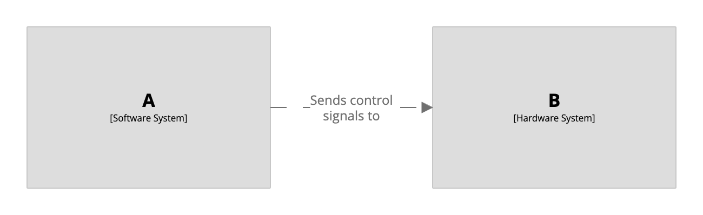

# Custom elements

The DSL [element](/dsl/language#element) keyword can be used to define elements that sit outside of the C4 model.
For example, perhaps a software system named A controls a hardware system named B.

```
workspace {

    model {
        a = softwareSystem "A"
        b = element "B" "Hardware System"

        a -> b "Sends control signals to"
    }

    views {
        systemContext a "Diagram1" {
            include *
            autoLayout lr
        }
    }
    
}
```

[](https://playground.structurizr.com?src=https://docs.structurizr.com/dsl/cookbook/custom-elements/example-1.dsl)

## Links

- [DSL language reference - element](/dsl/language#element)