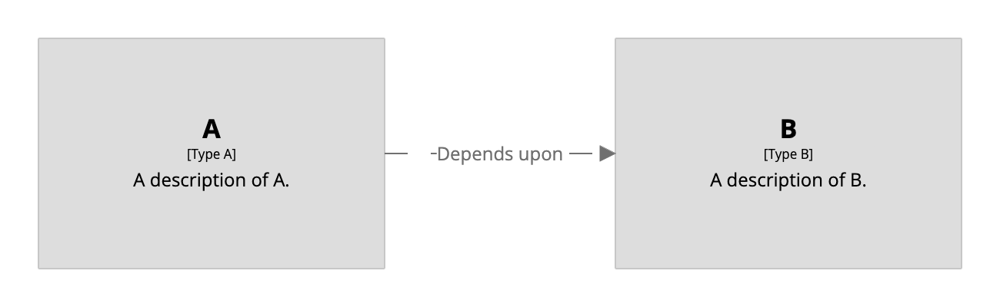

# Custom view

A [custom view](/ui/diagrams/custom-view) provides a way to create ad hoc diagrams, based upon the
same model+view approach and rendering engine.

```
workspace {

    model {
        a = element "A" "Type A" "A description of A."
        b = element "B" "Type B" "A description of B."

        a -> b "Depends upon"
    }

    views {
        custom "Diagram1" {
            title "A custom view"
            include *
            autoLayout lr
        }
    }
    
}
```

This DSL defines a custom view showing a couple of custom elements.

[](https://playground.structurizr.com?src=https://docs.structurizr.com/dsl/cookbook/custom-view/example-1.dsl)

## Links

- [DSL language reference - element](/dsl/language#element)
- [DSL language reference - custom](/dsl/language#custom-view)