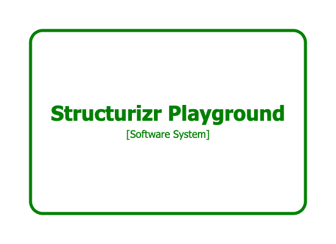

# Perspectives (dynamic)

> This feature is only available when building from source or using the `structurizr/structurizr:preview` Docker image.

Structurizr provides support for "dynamic" perspectives in addition to [static perspectives](/dsl/cookbook/perspectives-static),
where the `value` of the perspective is the result of making a URL call, configured via `url` property on the perspective.
This could be used to pull information from a remote data source, or for health monitoring. For example:

```
workspace {

    model {
        playground = softwareSystem "Structurizr Playground" {
            perspectives {
                perspective "Health" {
                    url "https://playground.structurizr.com/health"
                }
            }
        }
    }

    views {
        systemContext playground "SystemContext" {
            include *
        }

        styles {
            element "Element" {
                strokeWidth 5
                shape roundedbox
            }
            
            element "Perspective:Health" {
                stroke gray
            }
            element "Perspective:Health[value==OK]" {
                stroke green
                color green
            }
            element "Perspective:Health[value==0]" {
                stroke red
                color red
            }
        }
        
        properties {
            "structurizr.perspective.interval" "5000"
        }
    }

}
```

This DSL example defines a dynamic "Health" perspective for a software system, which polls the
[configured URL](https://playground.structurizr.com/health)
and uses  the response (in this case the text `OK`) as the perspective's value.
If no response body is present, the HTTP status is used instead.

[](https://playground.structurizr.com?src=https://docs.structurizr.com/dsl/cookbook/perspectives-dynamic/example-1.dsl&perspective=Health)

A view/viewset property named `structurizr.perspective.interval` can be used to configure the polling interval in milliseconds (default=`60000`).

## Links

- [DSL language reference - perspectives](/dsl/language#perspectives)