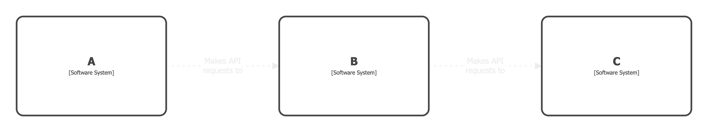
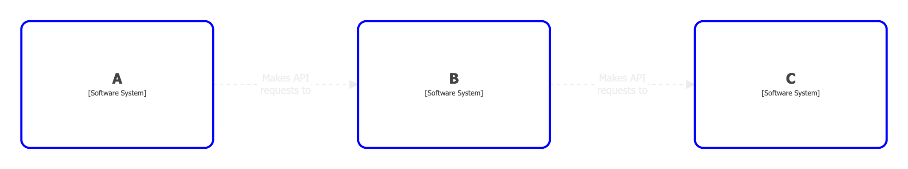
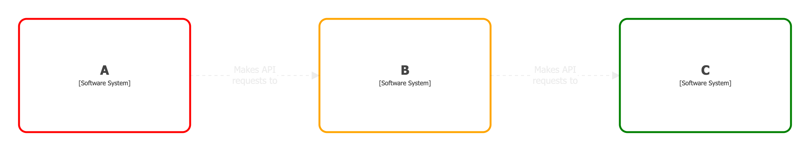
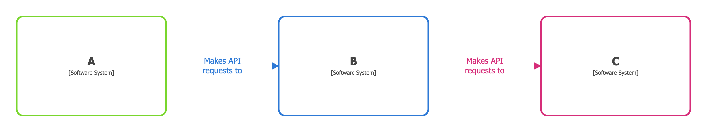

# Perspectives (static)

Structurizr supports the concept of "perspectives" from [viewpoints and perspectives](https://www.viewpoints-and-perspectives.info/home/perspectives/), where you want to look at a diagram with a view to answering a particular question. Perhaps you have a system landscape diagram showing software systems, and you'd like to see the ownership of each software system. Or perhaps you have a container diagram, and you'd like to see details of how each container satisfies the security requirements.

Perspectives can be added to any model element or relationship, with each perspective having an optional `description` and `value`. For example:

```
workspace {

    model {
        a = softwareSystem "A" {
            perspectives {
                perspective "Technical Debt" {
                    value "High"
                }
            }
        }
        b = softwareSystem "B" {
            perspectives {
                perspective "Technical Debt" {
                    value "Medium"
                }
            }
        }
        c = softwareSystem "C" {
            perspectives {
                perspective "Technical Debt" {
                    value "Low"
                }
            }
        }

        a -> b "Makes API requests to"
        b -> c "Makes API requests to"
    }

    views {
        systemLandscape "SystemLandscape" {
            include a b c
        }

        styles {
            element "Element" {
                shape roundedbox
                strokewidth 5
            }
        }
   }

}
```

This DSL example defines a "Technical Debt" perspective for each software system, which can be viewed by following the instructions at [Perspectives](/server/diagrams/perspectives) - use the
 button or the `p` key to view the current diagram with a given perspective, and hover the mouse pointer over an element to see perspective details.

[](https://playground.structurizr.com?src=https://docs.structurizr.com/dsl/cookbook/perspectives-static/example-1.dsl&perspective=Technical%20Debt)

## Perspective styles

> This feature is only available when building from source or using the `structurizr/structurizr:preview` Docker image.

Perspectives can be styled for additional visual variation. A single style can be defined to apply to all elements/relationships that have the perspective, using a style tag of `Perspective:<name>`. For example:

```
element "Perspective:Technical Debt" {
    stroke blue
}
```

[](https://playground.structurizr.com?src=https://docs.structurizr.com/dsl/cookbook/perspectives-static/example-2.dsl&perspective=Technical%20Debt)

Perspectives can also be styled based upon their value by adding `[value==<value>]` to the style tag:

```
element "Perspective:Technical Debt[value==High]" {
    stroke red
}
element "Perspective:Technical Debt[value==Medium]" {
    stroke orange
}
element "Perspective:Technical Debt[value==Low]" {
    stroke green
}
```

[](https://playground.structurizr.com?src=https://docs.structurizr.com/dsl/cookbook/perspectives-static/example-3.dsl&perspective=Technical%20Debt)

Styles can be applied to both elements (via element styles) and relationships (via relationship styles). This next example defines an ownership perspective, with styling for elements and relationships.

[](https://playground.structurizr.com?src=https://docs.structurizr.com/dsl/cookbook/perspectives-static/example-4.dsl&perspective=Ownership)

## Links

- [DSL language reference - perspectives](/dsl/language#perspectives)