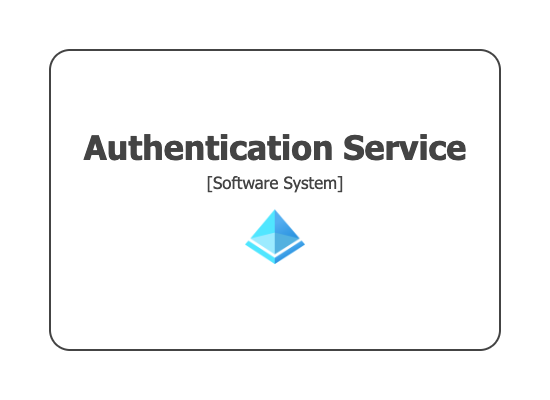

# Themes

Some pre-built themes are available to help you diagram deployment architectures that make use of popular cloud providers such as Amazon Web Services, Microsoft Azure, Google Cloud Platform, etc. Links to these themes can be found at [Themes](/server/diagrams/themes). You can also create your own themes.

## Using a theme

The `theme` or `themes` keywords can be used to include one or more themes in your workspace. You will also need to add the appropriate tags to your model elements/relationships.

```
workspace {

    model {
        softwareSystem "Authentication Service" {
            tags "Microsoft Azure - Azure Active Directory"
        }
    }

    views {
        systemLandscape {
            include *
            autoLayout lr
        }
        
        theme microsoft-azure-2021.01
    }
    
}
```

[](https://playground.structurizr.com?src=https://docs.structurizr.com/dsl/cookbook/themes/example-1.dsl)

For further customisation, themes can be used in conjunction with element/relationship styles that are defined in the workspace.

```
workspace {

    model {
        softwareSystem "Authentication Service" {
            tags "Microsoft Azure - Azure Active Directory"
        }
    }

    views {
        systemLandscape {
            include *
            autoLayout lr
        }
        
        styles {
            element "Software System" {
                shape RoundedBox
            }
        }
        
        theme microsoft-azure-2021.01
    }
    
}
```

[](https://playground.structurizr.com?src=https://docs.structurizr.com/dsl/cookbook/themes/example-2.dsl)

## Notes

Please note that themes are designed to work with the Structurizr diagram viewer, and may not be fully supported by the PlantUML, Mermaid, etc export formats.

- [DSL language reference - theme](/dsl/language#theme)
- [DSL language reference - themes](/dsl/language#themes)