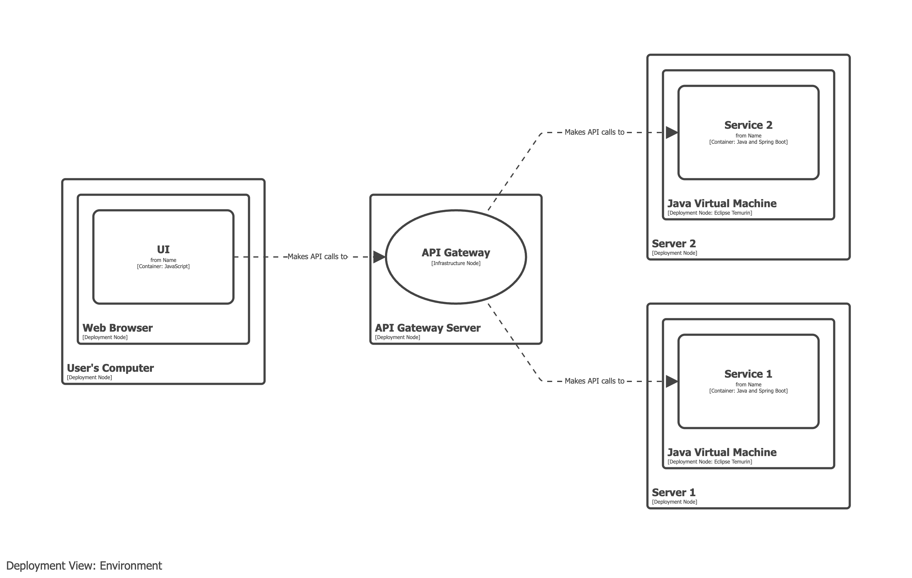
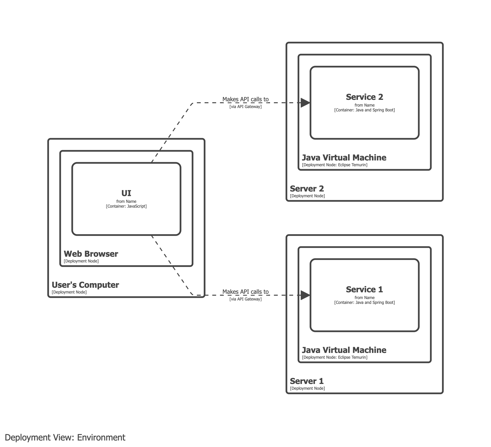

# API gateway

- An API gateway is _typically_ a deployment concept and should be modelled in your deployment model.
- API gateways can be modelled as a container when (1) you are building your own API gateway, (2) it's required in your development environment, and (3) it's doing more than rate limiting, routing, authentication, etc.

## Example 1

Model the API gateway as an infrastructure node, intercepting the communication between the UI and the backend services.

## Example 2

Model the API gateway as an annotation on the relationship between UI and backend services.

