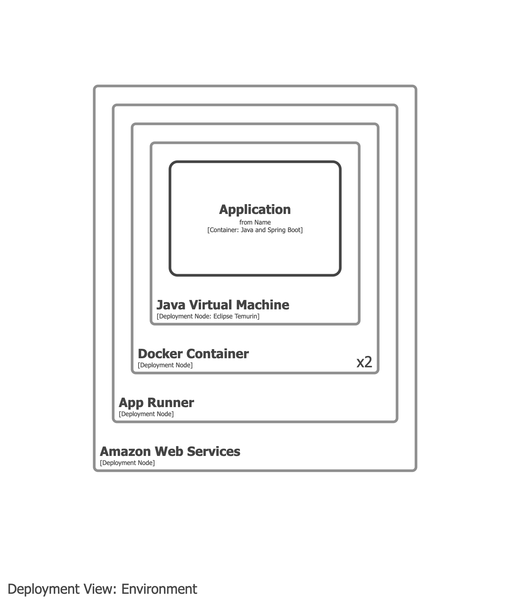
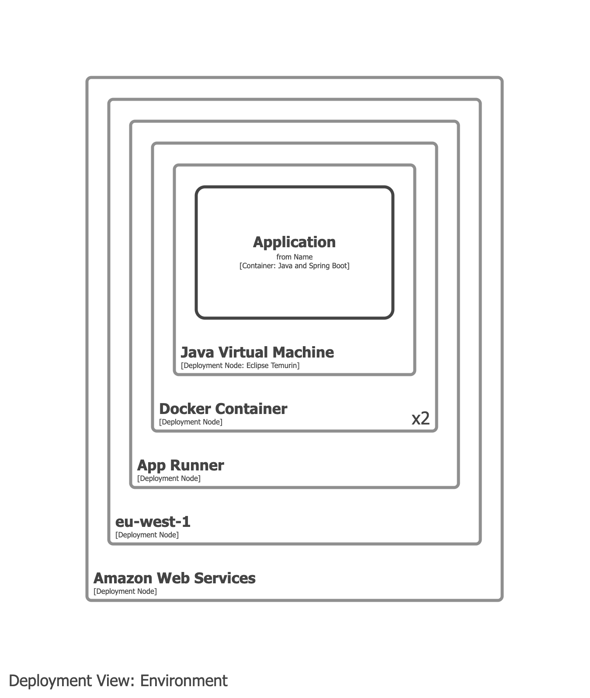

# Amazon Web Services App Runner

- App Runner is a deployment concept and should be modelled in your deployment model.
- App Runner should _not_ appear on container views.

## Example 1

Model App Runner and the Docker container as deployment nodes.

## Example 2

As above, but add the AWS region as a deployment node.

