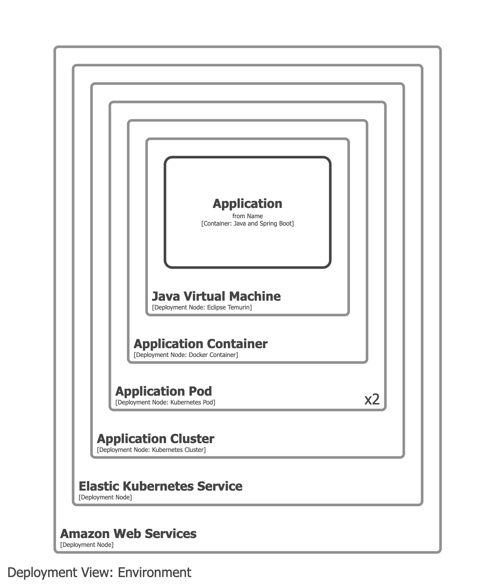

# Amazon Web Services Elastic Kubernetes Service

- Kubernetes is a deployment concept and should be modelled in your deployment model.
- Kubernetes should _not_ appear on container views.

## Example 1

Model EKS, the Kubernetes cluster, and pods as deployment nodes.

