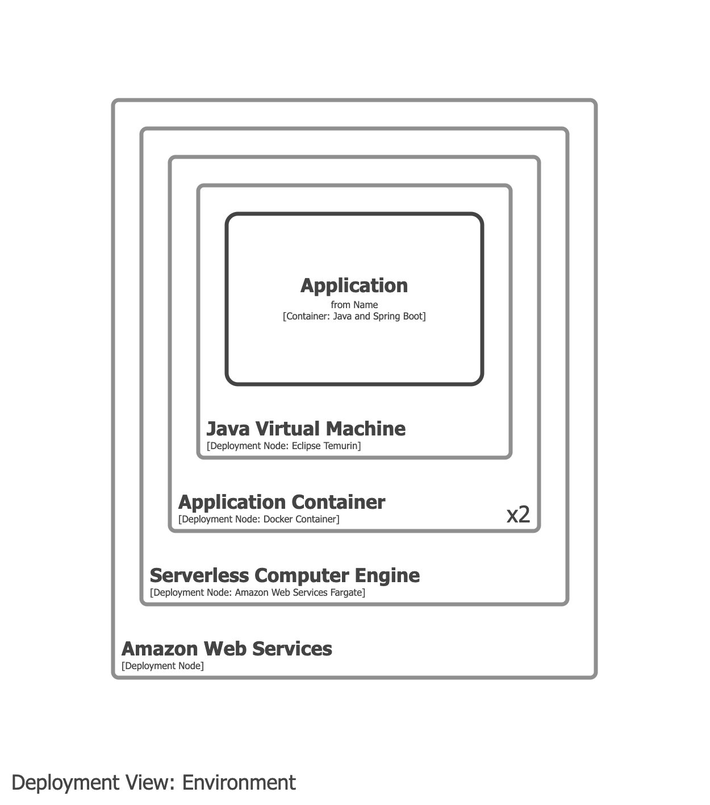

# Amazon Web Services Fargate

- Amazon Web Services Fargate is a deployment concept and should be modelled in your deployment model.
- Amazon Web Services Fargate should _not_ appear on container views.

## Example 1

Model Amazon Web Services Fargate and the Docker container as deployment nodes.

