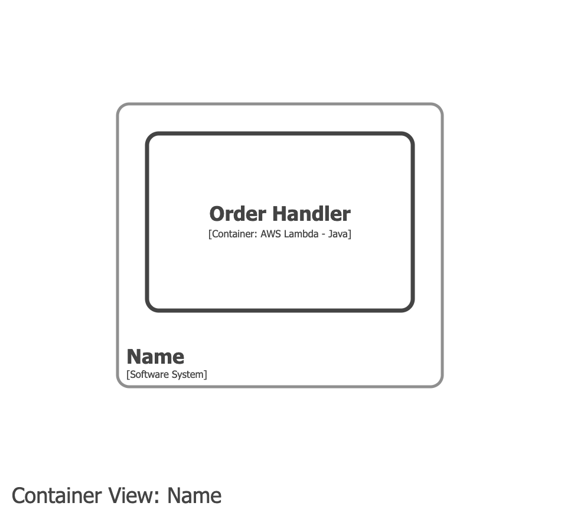
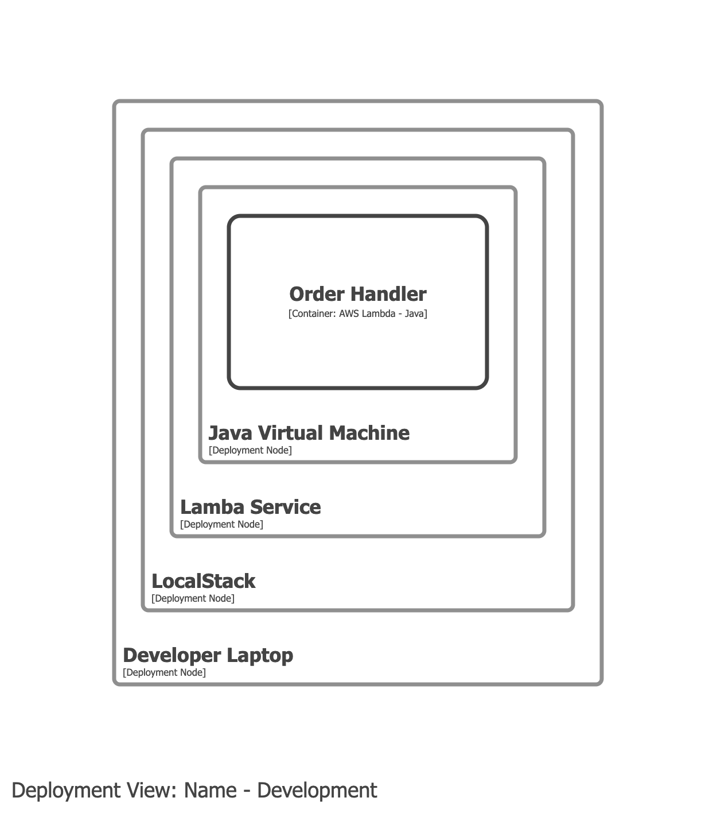
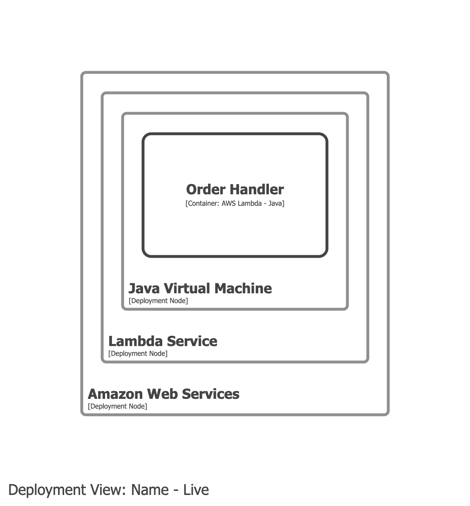

# Amazon Web Services Lambda

## Example 1

### Container view

Model the handler as a container. If the handler code does not have a dependency on `com.amazonaws:aws-lambda-java-core`, the technology of the handler can be just `Java`.

### Deployment view - development

In the development deployment environment, model the local services as a collection of nested deployment nodes. This example includes the Java Virtual Machine that the handler runs inside, but you can omit this for a simpler diagram.

### Deployment view - live

In the live deployment environment, model the AWS services as a collection of deployment nodes.

