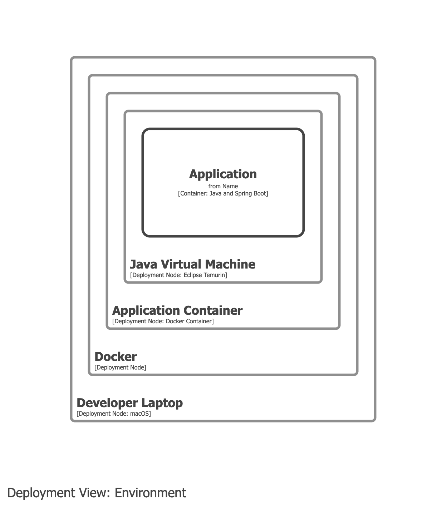
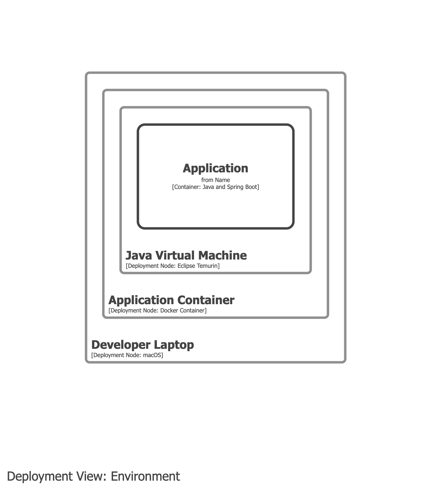

# Docker

- Docker is a deployment concept and should be modelled in your deployment model.
- Docker should _not_ appear on container views.

## Example 1

Model the Docker runtime and the Docker container as deployment nodes.

## Example 2

As above, but excludes the Docker runtime.

