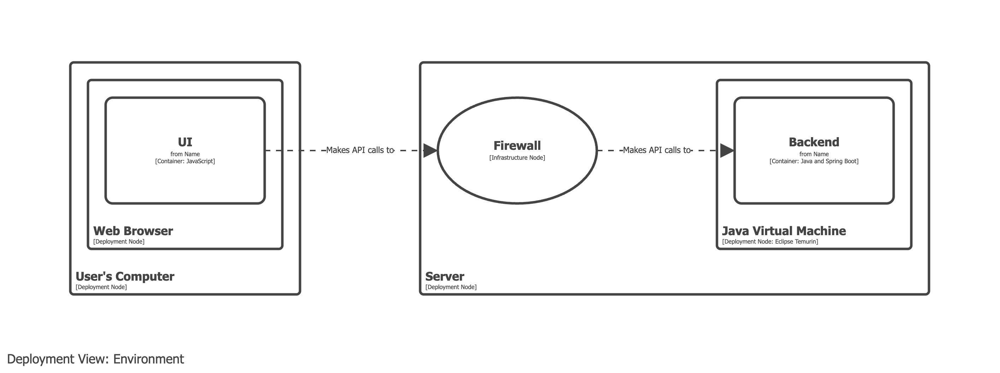

# Firewall

- A firewall is a deployment concept and should be modelled in your deployment model.
- Firewalls should _not_ appear on container views.

## Example 1

Model the firewall as an infrastructure node, intercepting the communication between the UI and the backend.

