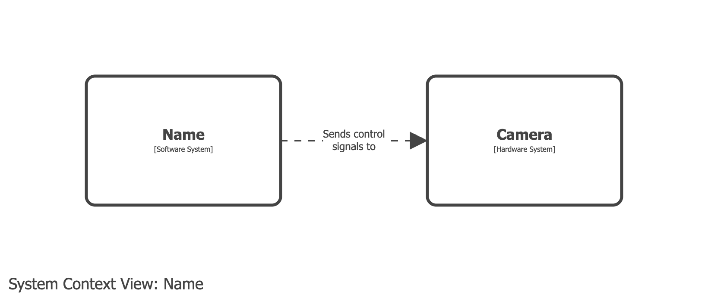

# Hardware system

- You need to model a hardware system, such as a camera/robot/device that your software controls.
- Model the hardware system as a [custom element](/dsl/cookbook/custom-elements), using an archetype if required.

