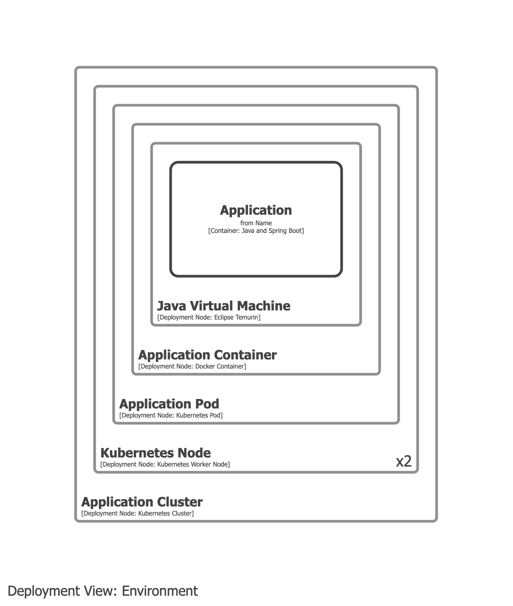
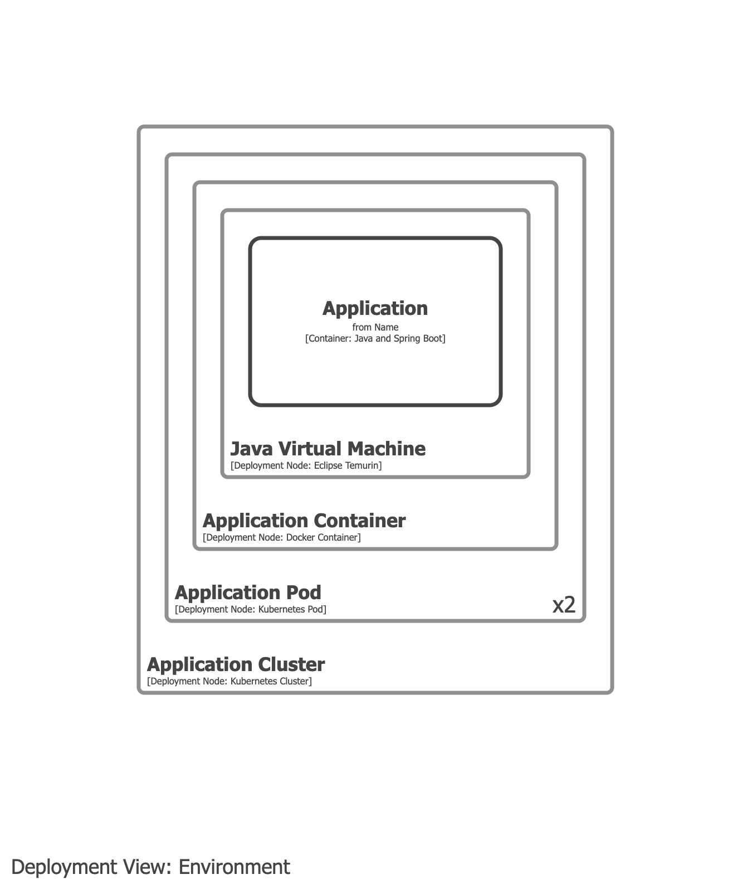

# Kubernetes

- Kubernetes is a deployment concept and should be modelled in your deployment model.
- Kubernetes should _not_ appear on container views.

## Example 1

Model the Kubernetes cluster, nodes, and pods as deployment nodes.

## Example 2

As above, but excludes the nodes for a simpler diagram.

