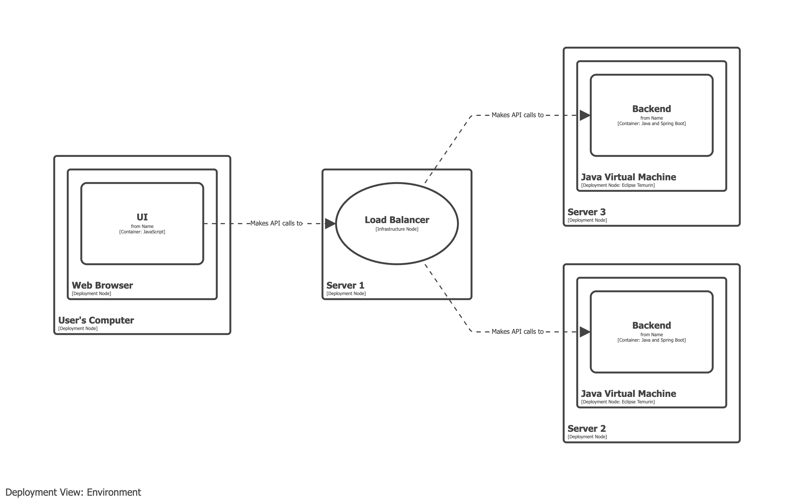

# Load balancer

- A load balancer is a deployment concept and should be modelled in your deployment model.
- Load balancers should _not_ appear on container views.

## Example 1

Model the load balancer as an infrastructure node, intercepting the communication between the UI and the backend.

