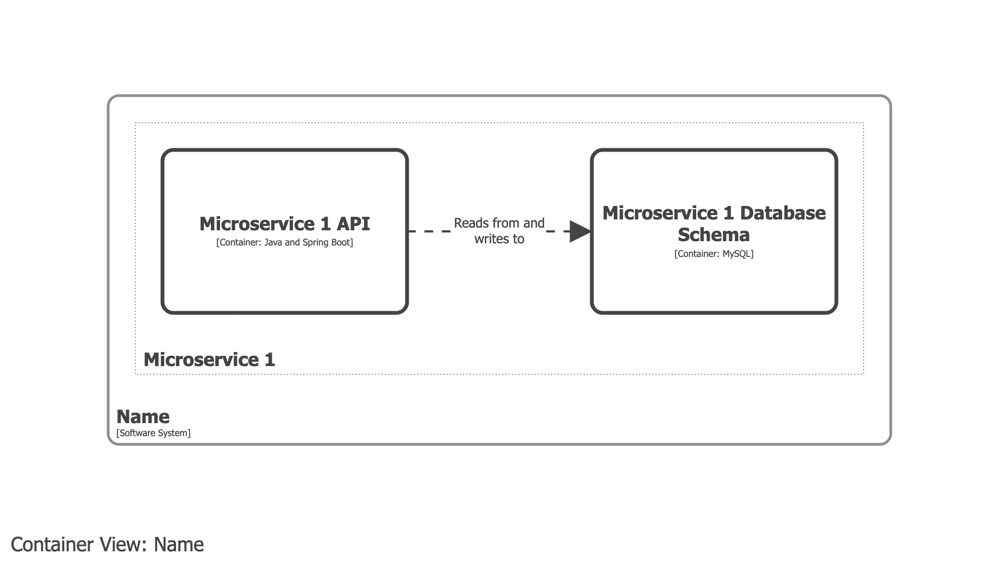

# Microservice

According to [the original definition](https://martinfowler.com/articles/microservices.html):

> In short, the microservice architectural is an approach to developing a single application as a suite of small services, each running in its own process and communicating with lightweight mechanisms, often an HTTP resource API.

To bring this into the C4 model, switch "single application" for "single software system".

## Example 1

A microservice is modelled as group of one more containers, rather than a container itself.

