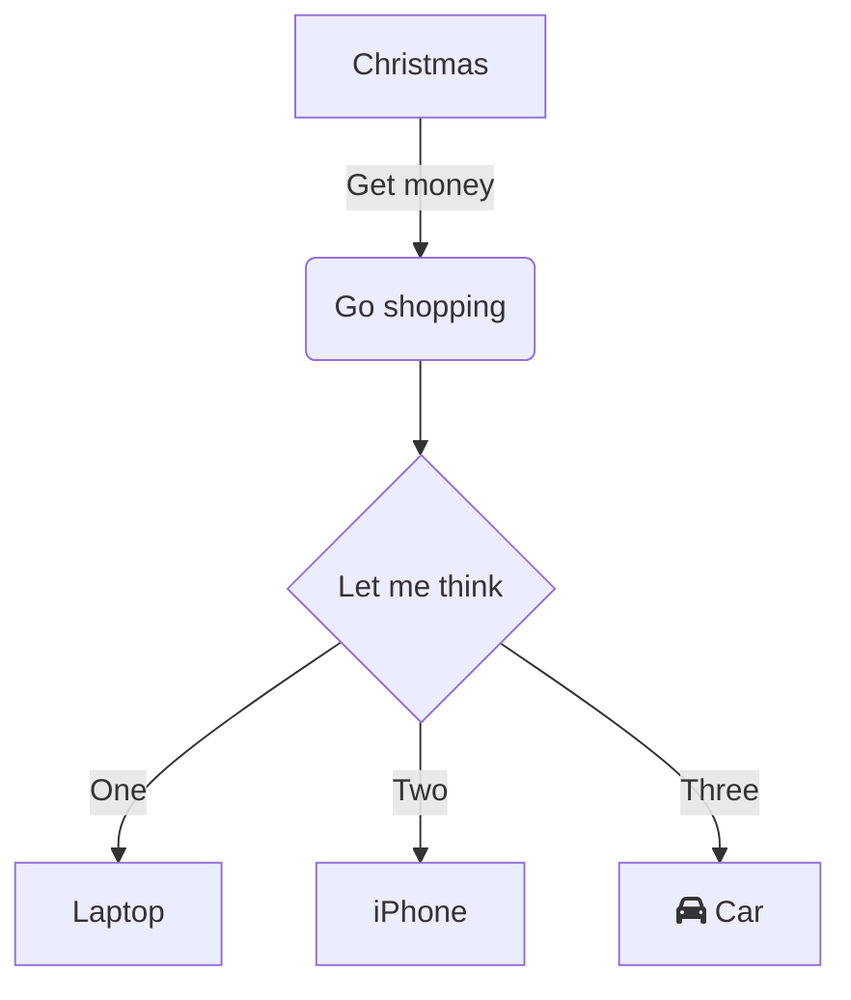

# Mermaid

This Structurizr DSL plugin looks for inline Mermaid diagram definitions in Markdown/AsciiDoc documentation and decisions, and encodes them as images.

## Markdown

This definition in Markdown content:

````

````

Will be converted to:

```

```

Which renders as:


## AsciiDoc

This definition in AsciiDoc content:

```
[mermaid]
....
flowchart TD
    A[Christmas] -->|Get money| B(Go shopping)
    B --> C{Let me think}
    C -->|One| D[Laptop]
    C -->|Two| E[iPhone]
    C -->|Three| F[fa:fa-car Car]
....
```

Will be converted to:

```
image::https://mermaid.ink/svg/pako:eJxVj70OgjAUhV_lppMm8gIMJlKUhUQHtspwAxfbSH9SaoihvLsgi571-85JzgSssS2xlHW9HRuJPkCV3w0sOQkuvRqCxqGGJDnGggJoa-gdIdsVFgZpnVPmsd_8bJWAT-WqEQSpzHPeEP_2r4Yi5KJEF6yrf0k12ghnoW5ymf8n0tPSuogO0w6TBj1w9DU7ANPkNaqWpRMLkvR6oqUOX31g8_wBLY9E1w==[]
```

Which renders as:


## Usage

The plugin can be referenced from your DSL file as follows (after all `!docs`, `!adrs`, and `views`):

```
!plugin com.structurizr.dsl.plugin.documentation.Mermaid
```

You will need to provide a Mermaid URL, and optionally a format (`png` or `svg`),
when using this plugin. These can be specified as view set properties:

```
views {
    properties {
        "mermaid.url" "http://localhost:8888"
        "mermaid.format" "svg"
    }
    
    ...
}
```

The public Mermaid URL (`https://mermaid.ink`) may work, but please be aware that you are sending
information to a third-party service.

Compression (pako) is used by default, but can be disabled via a view set property named `mermaid.compress`
with a value of `false`.