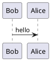

# PlantUML

This Structurizr DSL plugin looks for inline PlantUML diagram definitions in Markdown/AsciiDoc documentation
and decisions, and encodes them as images.

> This plugin is available exclusively to Gold members of the [Structurizr Patreon](https://www.patreon.com/structurizr) - an early access version is now available.

## Markdown

This definition in Markdown content:

````

````

Will be converted to:

```

```

Which renders as:


## AsciiDoc

This definition in AsciiDoc content:

```
[plantuml]
....
@startuml
Bob -> Alice : hello
@enduml
....
```

Will be converted to:

```
image::http://plantuml.com/plantuml/svg/SoWkIImgAStDuNBAJrBGjLDmpCbCJbMmKiX8pSd9vt98pKi1IW80[]
```

Which renders as:


## Usage

After [installation](/dsl/plugins#installation), the plugin can be referenced from your DSL file as follows:

```
!plugin com.structurizr.dsl.plugin.documentation.PlantUML
```

This should appear after any `!docs` and/or `!adrs` statements that import documentation into your workspace.

You will need to provide a PlantUML URL, and optionally a format (`png` or `svg`),
when using this plugin. These can be specified as view set properties:

```
views {
    properties {
        "plantuml.url" "http://localhost:8888"
        "plantuml.format" "svg"
    }
    
    ...
}
```

The public PlantUML URL (`https://plantuml.com/plantuml`) may work, but please be aware that you are sending
information to a third-party service.