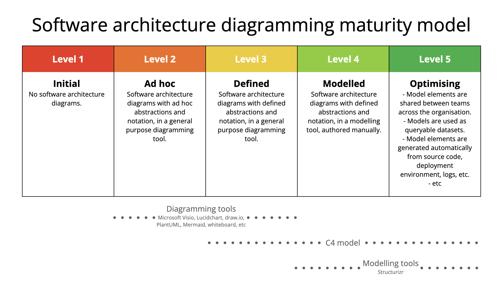
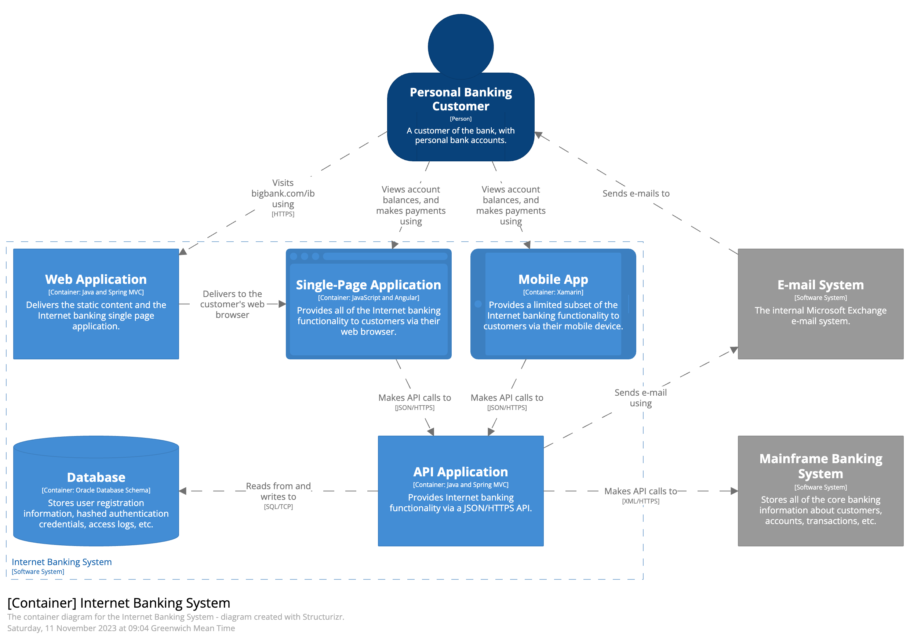
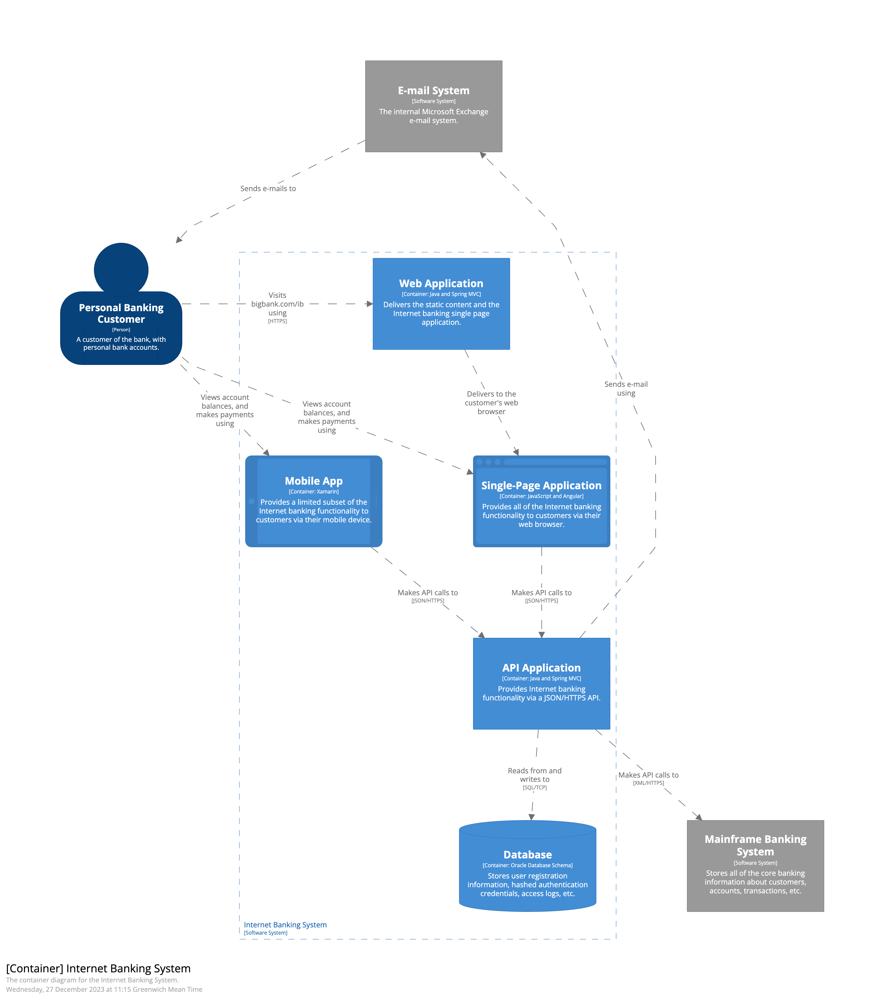
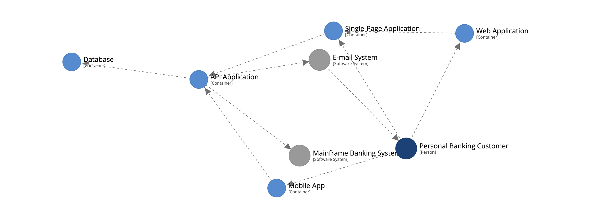
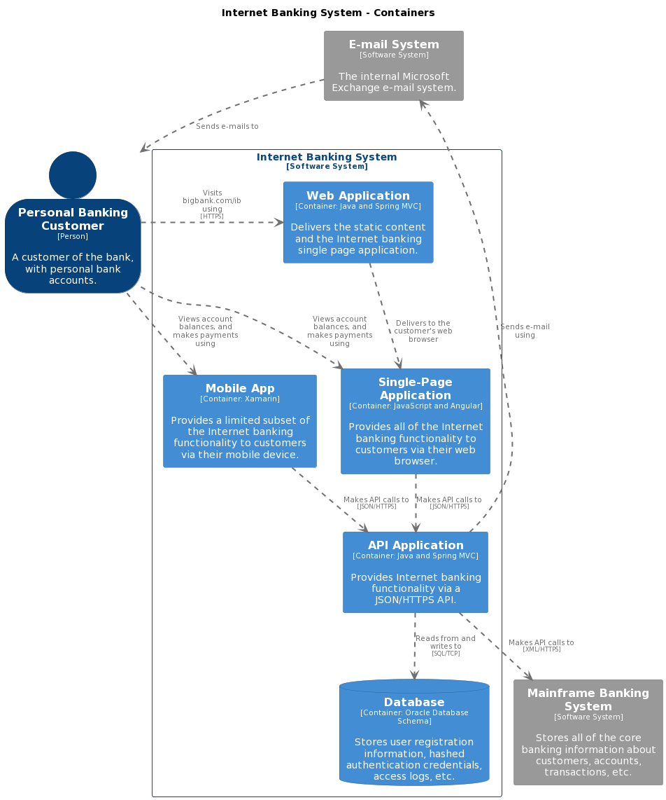
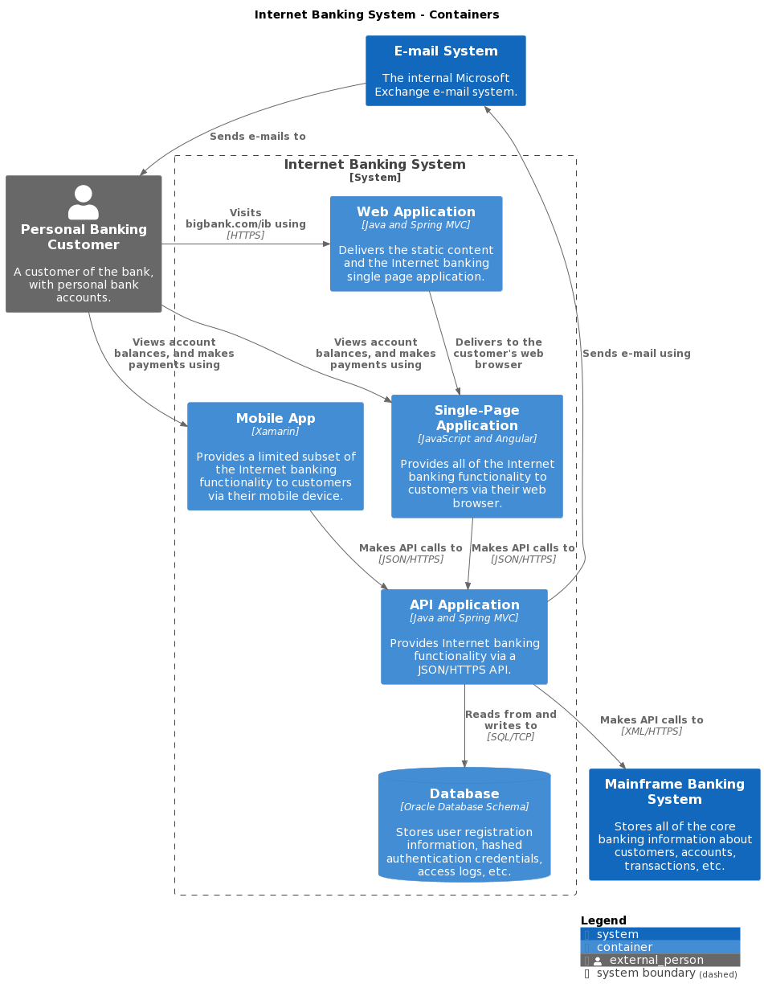
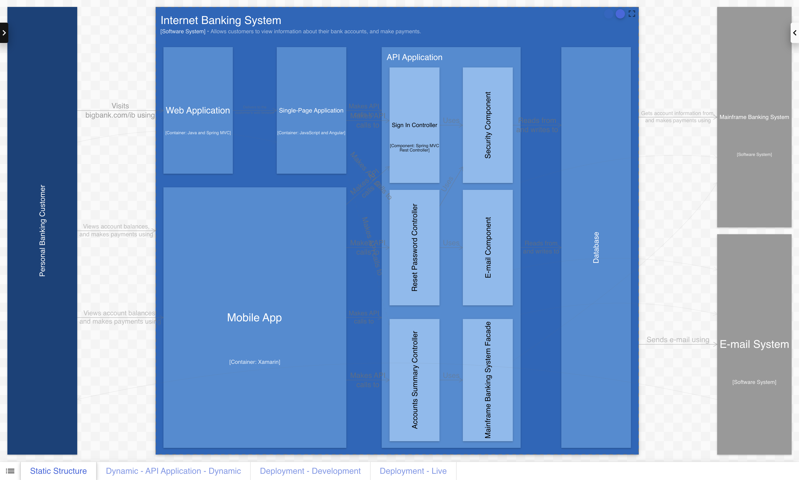

# Structurizr

Structurizr builds upon "diagrams as code", allowing you to create
__multiple software architecture diagrams__, in a __variety of rendering tools__, from a __single model__.

<div style="text-align: center">
<iframe width="560" height="315" src="https://www.youtube-nocookie.com/embed/LYzOc7vI-Uo?si=Fiwayepq9xOKpgeK" title="YouTube video player" frameborder="0" allow="accelerometer; autoplay; clipboard-write; encrypted-media; gyroscope; picture-in-picture; web-share" allowfullscreen></iframe>
</div>

## C4 model

Structurizr is specifically designed to support the [C4 model for visualising software architecture](https://c4model.com),
allowing you to reach the highest levels of maturity associated with creating software architecture diagramming.



## Model-based

Structurizr is a modelling tool, allowing you to create multiple diagrams from a single model.
Here's an example with the [Structurizr DSL](/dsl):

```
workspace {

    model {
        user = person "User"
        
        softwareSystem = softwareSystem "Software System" {
            webapp = container "Web Application"
            db = container "Database Schema"
        }

        user -> webapp "Uses"
        webapp -> db "Reads from and writes to"
    }

    views {
        systemContext softwareSystem "SystemContext" {
            include *
            autolayout lr
        }

        container softwareSystem "Containers" {
            include *
            autolayout lr
        }
        
        styles {
            element "Person" {
                shape person
            }
        }
    }

}
```

## Authoring tool independent

The [Structurizr DSL](/dsl) shown above is just one way to author your software architecture models.
There are also a number of programming language libraries (e.g. [Structurizr for Java](/java),
and ports for [.NET, Python, PHP, TypeScript, etc](/community#authoring-tools))
that can be used to create software architecture models.
The [open JSON data format](https://github.com/structurizr/json) defines the data format for a Structurizr compatible "workspace",
which is the wrapper for a software architecture model and views.

With this in mind, Structurizr workspaces can be created in the following ways:

1. Manually authored:
   - Using the [Structurizr DSL](/dsl) ([example](https://github.com/structurizr/examples/blob/main/dsl/getting-started/workspace.dsl)).
   - Using [Structurizr for Java](/java) ([example](https://github.com/structurizr/examples/blob/main/java/src/main/java/com/structurizr/example/GettingStarted.java)) or one of the ports for [.NET, Python, PHP, TypeScript, etc](/community#authoring-tools).
2. Reverse-engineered:
   - Using [Structurizr for Java](/java) or one of the ports for [.NET, Python, PHP, TypeScript, etc](/community#authoring-tools) to write a program to reverse-engineer model information from source code, deployment scripts, your live deployment environment, logs, traces, telemetry data, etc).
3. Hybrid approach:
   - Use the Structurizr DSL to define software systems and containers, and reverse-engineer component level details via code.
   - Use code to reverse-engineer a system catalog from Backstage ([example](https://github.com/structurizr/examples/tree/main/enterprise#example-3)), ServiceNow, etc and have teams add container and component level detail via the Structurizr DSL.

## Rendering tool independent

Unlike most modelling tools, and because of the open JSON data format, Structurizr is rendering tool independent.
For example, here are a number of visualisations of the same model.

|-----------------------------------------------------------------------------------------------|-------------------------------------------------------------------------------------------------------------------------------------------------------------------------------|
| Structurizr cloud service, on-premises installation, and Lite - diagram with manual layout    | [](https://structurizr.com/share/36141/diagrams#Containers)                                 |
| Structurizr cloud service, on-premises installation, and Lite - diagram with automatic layout | [](https://structurizr.com/dsl?example=big-bank-plc&view=Containers&renderer=diagram) |
| Structurizr cloud service, on-premises installation, and Lite - graph (interactive layout)    | [](https://structurizr.com/dsl?example=big-bank-plc&view=Containers&renderer=graph)                                       |
| PlantUML via the Structurizr CLI (automatic layout only)                                      | [](https://structurizr.com/dsl?example=big-bank-plc&view=Containers&renderer=plantuml)                                |
| C4-PlantUML via the Structurizr CLI (automatic layout only)                                   | [](https://structurizr.com/dsl?example=big-bank-plc&view=Containers&renderer=c4plantuml)                         |
| Mermaid via the Structurizr CLI (automatic layout only)                                       | [](https://structurizr.com/dsl?example=big-bank-plc&view=Containers&renderer=mermaid)                                   |
| Ilograph via the Structurizr CLI (interactive layout)                                         | [](https://structurizr.com/dsl?example=big-bank-plc&view=Containers&renderer=ilograph)                                |