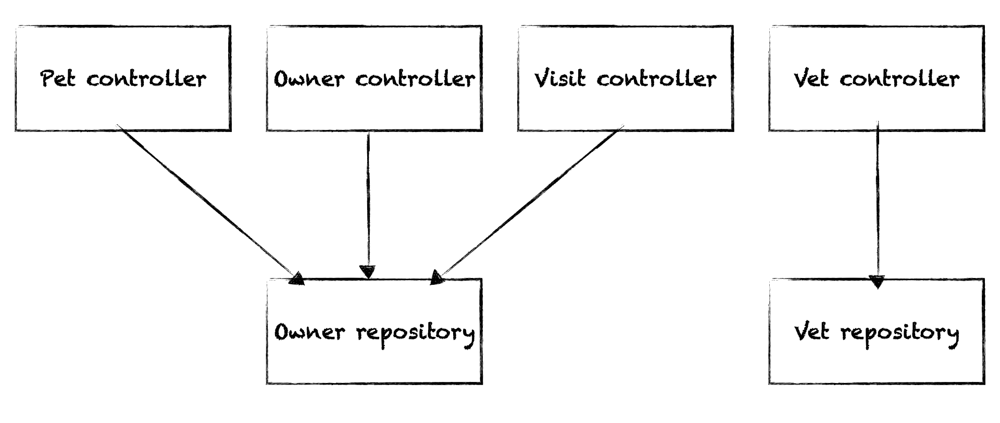

# Introduction

This page introduces the basic theory and concepts behind the Structurizr component finder in the context
of the [Spring PetClinic](https://github.com/spring-projects/spring-petclinic) application (v3.4.0) - a sample codebase that illustrates how to build a Java web application using 
the Spring MVC framework. From a non-technical perspective, it's a software system designed for an imaginary pet clinic 
that stores information about pets and their owners, visits made to the clinic, and the vets who work there. The system 
is only designed to  be used by employees of the clinic. From a technical perspective, the Spring PetClinic system 
consists of a web application and a relational database schema. From a structural perspective, this codebase is a 
traditional layered architecture.  

Reverse-engineering this codebase into a UML class diagram generates the following diagram, showing all classes 
and interfaces.

[](./images/spring-petclinic-1.png)

In terms of the C4 model, this is level 4 - the code. To zoom-out and generate a component diagram at level 3, we need 
to define a set of rules that we can use to identify components. These rules can then be codified using the Structurizr
component finder to make this an automated process. This is a multi-step process, and may require more than a single 
iteration as you explore and learn more about the codebase:

1. Identify components
1. Categorise components
1. Define component identification rules

At this point it's worth noting that since every codebase is unique, it's almost impossible to create a generic set of 
rules that can be blindly applied to all codebases. Component identification therefore requires some knowledge of the 
codebase so that the appropriate rules and heuristics can be applied.

## Step 1: Identify components

Before attempting to reverse-engineer a codebase, you need to understand the codebase and have an idea of what the end-result will look like.
This is about agreeing upon a simplification/abstraction of the code that should reflect how everybody on the team views the code from a high-level
perspective. You're looking to answer the following basic questions:

- What architectural style is embodied in the codebase? (e.g. package by layer, package by feature, package by component, hexagonal, ports and adapters, etc)
- What are the components that you expect to see on a component diagram?

Essentially this is a first pass at understanding the set of components that should appear on the component diagram.
You have a couple of options to do this.

### Option 1: Sketch a component diagram

The first option is to sketch what you think the component diagram will look like.
The Spring PetClinic web application is a traditional "package by layer" style of architecture and, assuming that
I'm familiar with the codebase and how it works, I might sketch a diagram like this:

[](./images/spring-petclinic-2.png)

Consider this as a starting point. Any diagram drawn at this stage doesn't need to be comprehensive or accurate.

### Option 2: Start with a UML class diagram

If you have a relatively small codebase, the second option is to start by reverse-engineering a UML class diagram,
and remove the types that you don't think are relevant when looking at the component-level architecture.

[](./images/spring-petclinic-1.png)

Starting at the top of the UML class diagram above, we have the following types:

- `BaseEntity`
- `NamedEntity`
- `Person`
- `Specialty`
- `PetType`
- `Visit`
- `Vet`
- `Vets`
- `Owner`
- `Pet`

All of these types are essentially just data structures with very minimal logic aside from some data validation,
or superclasses thereof, and are used throughout the codebase. For this reason, they are arguably not that important at
the component level. Again, every codebase is unique, and although these types are essentially just
data structures in this example, that might not be the case in a codebase that is more aligned with domain-driven domain
concepts, where domain objects are [rich rather than anemic](https://martinfowler.com/bliki/AnemicDomainModel.html). For the purposes of this example though, let's ignore them.

Let's also ignore the `PetValidator` class, as it's just used for HTML form validation. `PetTypeFormatter` is used by
Spring MVC to print/display pet types, so again doesn't seem particularly important. `PetClinicRuntimeHints` and
`CacheConfiguration` help configure the Spring application, with `PetClinicApplication` being the application entry
point (`public static void main()`).

Ignoring all of these types provides us this diagram:

[](./images/spring-petclinic-3.png)

If we move the elements around, we can see the layered architecture start to emerge.

[](./images/spring-petclinic-4.png)

## Step 2: Categorise components

We can now use the diagram created during step 1 to help us group similar types of components.
In this example, we have two categories of components:

- Web controllers
- Data repositories

Ideally, all web controllers should be identifiable by one set of rules, and all data repositories should be identifiable by another.

## Step 3: Define component identification rules

On a category by category basis, we now want to define the set of rules that can be used to identify components
of that category across the codebase. There are actually two different questions that need to be answered here:

1. How do we identify the primary type of the component?
2. How do we identify the supporting types of the component?

### Primary type

Think of this as being the unique identifier for the component in the codebase, expressed as a fully qualified class
or interface name. It's the type that best represents the component.
For the web controllers in the Spring PetClinic codebase, these are as follows:

- `org.springframework.samples.petclinic.owner.OwnerController`
- `org.springframework.samples.petclinic.owner.PetController`
- `org.springframework.samples.petclinic.owner.VisitController`
- `org.springframework.samples.petclinic.system.CrashController`
- `org.springframework.samples.petclinic.system.WelcomeController`
- `org.springframework.samples.petclinic.vet.VetController`

Imagine that all the Java classes, interfaces, and enums from the application
have been loaded into a data store. What query could we use to find these types?

In this particular example, you have a few options, both of which would work equally well:

1. Find all types that have been annotated with Spring's `@Controller` annotation.
2. Find all types where the name matches the `.*Controller` regular expression.
3. Find all types where the name ends `Controller`.

Repeating the process for the data repositories, we have:

- `org.springframework.samples.petclinic.owner.OwnerRepository`
- `org.springframework.samples.petclinic.vet.VetRepository`

And to find these types, we could use one of the following queries:

1. Find all subtypes of the `org.springframework.data.repository.Repository` and `org.springframework.data.jpa.repository.JpaRepository` interfaces.
2. Find all types where the name matches the `.*Repository` regular expression.
3. Find all types where the name ends `Repository`.

### Supporting types

This is a more advanced topic and not relevant for the Spring PetClinic application, so we'll cover it separately.

## Step 4: Codify the rules

Now that we have some rules that we can use to identify components, we can codify them using the Structurizr
component finder to automate the process of reverse-engineering a component diagram from code.

There are a few loose ends to tie up, so we're not quite done yet, and we'll look at the Spring PetClinic example
in more detail separately. For now though, here's what a Java implementation of the rules above looks like with Java:

```
Container webApplication = softwareSystem.addContainer("Web Application");

ComponentFinder componentFinder = new ComponentFinderBuilder()
        .forContainer(webApplication)
        .fromClasses(new File("spring-petclinic.jar"))
        .withStrategy(
                new ComponentFinderStrategyBuilder()
                        .matchedBy(new AnnotationTypeMatcher("org.springframework.stereotype.Controller"))
                        .withTechnology("Spring MVC Controller")
                        .build()
        )
        .withStrategy(
                new ComponentFinderStrategyBuilder()
                        .matchedBy(new NameSuffixTypeMatcher("Repository"))
                        .withTechnology("Spring Data Repository")
                        .build()
        )
        .build();

componentFinder.run();
```

And here's the equivalent Structurizr DSL:

```
webApplication = container "Web Application" {

    !components {
        classes "spring-petclinic.jar"
        strategy {
            technology "Spring MVC Controller"
            matcher annotation "org.springframework.stereotype.Controller"
        }
        strategy {
            technology "Spring Data Repository"
            matcher name-suffix "Repository"
        }
    }
}
```

In summary this code:

- Creates a container named "Web Application".
- Creates a component finder for it, meaning that all components discovered will be added to the container.
- Tells the component finder that we wish to use the compiled classes in the specified `.jar` file as the source of information.
- Creates two strategies to find components:
  1. "Spring MVC Controllers" are identified by types annotated `@Controller`.
  2. "Spring Data Repositories" are identified by types that have a name ending `Repository`.

This results in the following diagram:

[](./images/spring-petclinic-5.png)

## Summary

We've looked at the theory behind the component finder, and seen a basic example of how to codify some rules
to automatically identify components from a Java codebase. While the diagram shown above is good start, there
are some improvements that we could make:

- Exclude the `CrashController` (the Javadoc says that it is "used to showcase what happens when an exception is thrown").
- Add inbound relationships to components from outside the web application container.
- Add outbound relationships from components to elements outside the web application container.
- Add component descriptions.
- Add clickable hyperlinks from a component to the code.