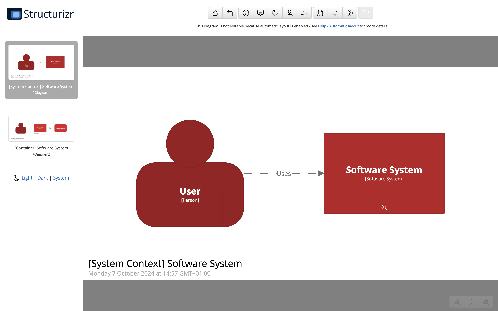

# Quickstart

Here's a quick getting started to using Structurizr Lite via the pre-built Docker image,
and assumes that you have Docker installed.

## 1. Create a directory

First you need to create a directory somewhere to store your workspace.
We'll refer to this directory as the "Structurizr data directory".

## 2. Start Structurizr Lite

You can now start Structurizr Lite with the following commands, replacing `PATH` with the path to your Structurizr data directory:

```
docker pull structurizr/lite
docker run -it --rm -p 8080:8080 -u $(id -u):$(id -g) -v PATH:/usr/local/structurizr structurizr/lite
```

For example, if your Structurizr data directory is located at `/Users/simon/structurizr`, the command would be:

```
docker pull structurizr/lite
docker run -it --rm -p 8080:8080 -i $(id -u):$(id -g) -v /Users/simon/structurizr:/usr/local/structurizr structurizr/lite
```

## 3. Open your web browser

With Structurizr Lite running, you can head to [http://localhost:8080](http://localhost:8080) in your web browser, where
you should see the diagram editor:



At startup, Structurizr Lite created a file named `workspace.dsl` in your Structurizr data directory as a starting point.
This is a Structurizr workspace, defined using the [Structurizr DSL](/dsl).

## 4. Make some changes

You can now modify the `workspace.dsl` file, save the changes, and refresh your web browser to see those changes.
Some useful links related to the DSL are:

- [Structurizr DSL example](/dsl/example)
- [Structurizr DSL tutorial](/dsl/tutorial)
- [Structurizr DSL language reference](/dsl/language)
- [Structurizr DSL cookbook](/dsl/cookbook)
