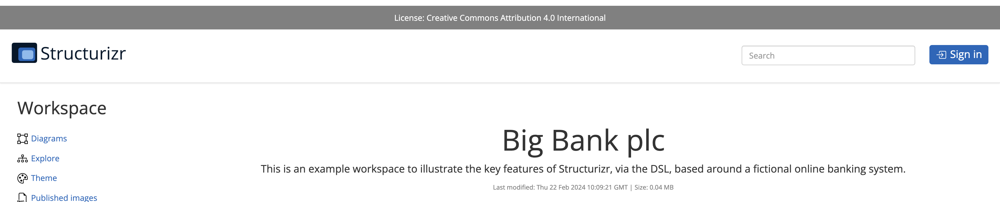

# Customisation

The on-premises installation has some mechanisms that allow for some minor customisation of the UI.

## structurizr.css

The CSS used to render the on-premises installation can be customised by adding a file named `structurizr.css` to the
Structurizr data directory containing CSS definitions that you would like to override (e.g. font definitions).
The opening and closing `<style>` tags are not required.

## structurizr.js

Arbitrary JavaScript (e.g. using JQuery or vanilla JavaScript) can be included into all pages by adding
a file named `structurizr.js` to the  Structurizr data directory.
The opening and closing `<script>` tags are not required.

In addition to ad hoc JavaScript, there are a couple of callback methods that you can implement, which are called
before and after a workspace has been loaded.

- `beforeWorkspaceLoaded(json)`
- `afterWorkspaceLoaded(json)`

## Examples

### Example 1: Adding a banner to all pages

A banner can be added to all pages of the on-premises installation by adding some CSS and JavaScript as follows:

[](/onpremises/images/customisation-1.png)

#### structurizr.css

```
#banner {
    background: gray;
    color: white;
    border-top: 10px solid white;
    padding: 10px;
}

#banner a {
    color: white;
}
```

#### structurizr.js

```
$(document).ready(function() {
    $('#banner').html('Please remember to register all new software systems at <a href="backstage.example.com" target="_blank">https://backstage.example.com</a>');
});
```

### Example 2: Adding a banner to workspace pages to show the content license

A banner (in this case based upon a workspace property) can be added to all workspace pages by adding some CSS and JavaScript as follows:

[](/onpremises/images/customisation-2.png)

#### structurizr.css

```
#banner {
    background: gray;
    color: white;
    border-top: 10px solid white;
    padding: 10px;
}
```

#### structurizr.js

```
function afterWorkspaceLoaded(workspace) {
    if (workspace.properties && workspace.properties['license']) {
        $('#banner').text('License: ' + workspace.properties['license']);
    } else {
        $('#banner').text('Warning: This workspace has no license');
    }
}
```

