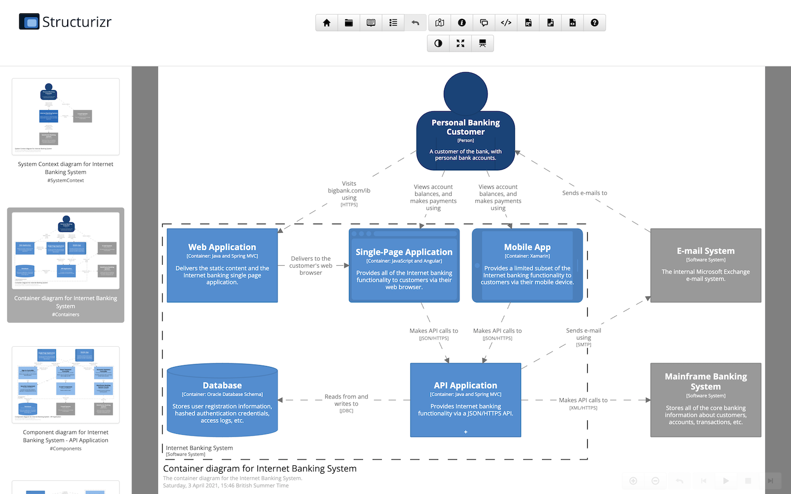
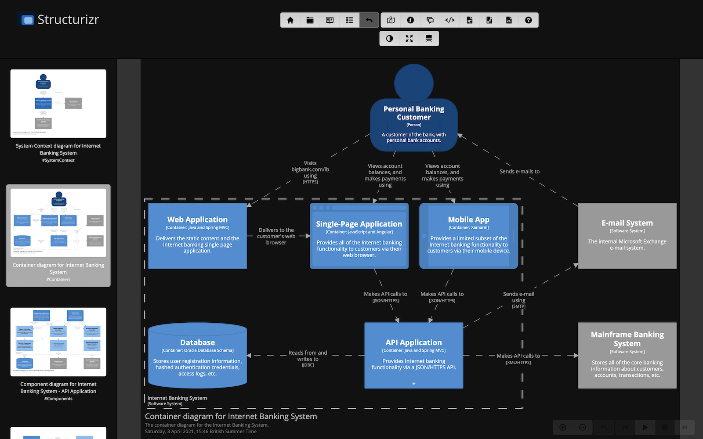

# Dark mode

Structurizr supports dark mode, determined automatically from your web browser settings, although this can be
overridden via the " Light | Dark | System" links you can find on the
diagrams, documentation, and decisions pages.

PNG/SVG/HTML diagram exports will reflect dark mode too, and please note that dark mode will not change any
element or relationship styles on your diagrams, so you may need to modify these so that your diagrams render
correctly in both light and dark modes.

|---------------------------------------|--------------------------------------|
|  |  |