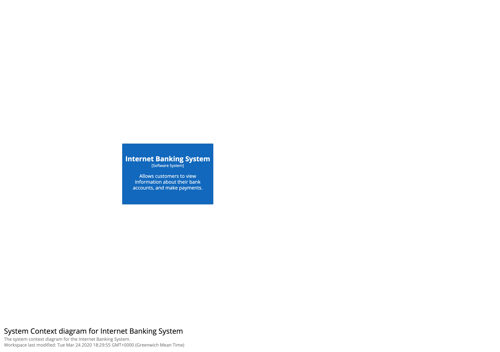
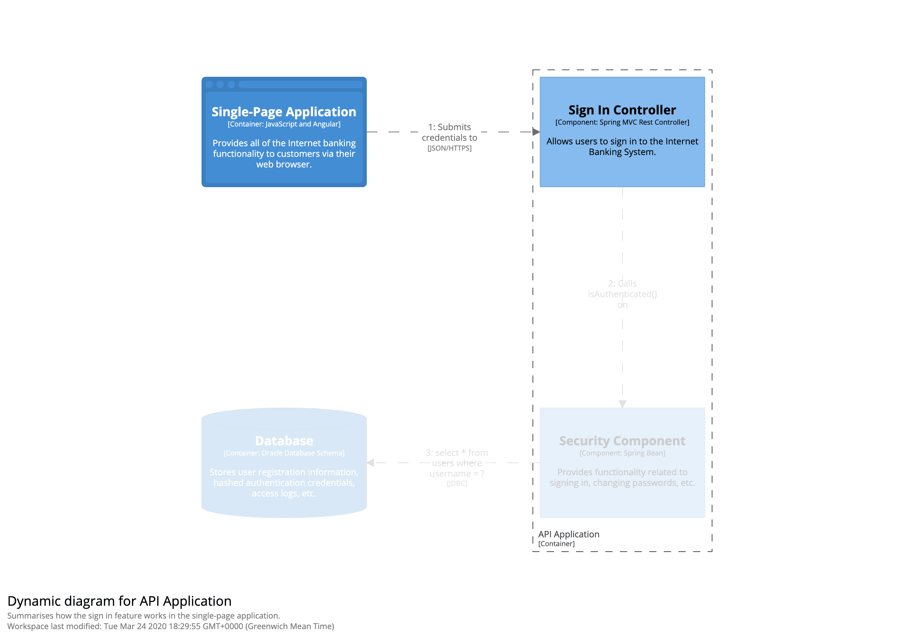

# Animation

Structurizr allows you to define an animation for a view, consisting of a number of steps where elements and/or
relationships are displayed. As with presentation tools like Microsoft PowerPoint, the animation feature allows you
to reveal parts of the diagram to help tell a story.

The animation is element based for system context, container, component, deployment, and custom views.

The animation is relationship based for dynamic views.

You can use the buttons to progress forward/backward through the animation,
or the [keyboard shortcuts](/ui/diagrams/keyboard-shortcuts).