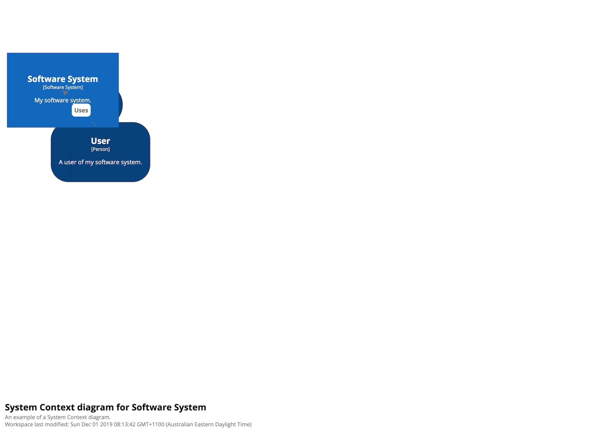
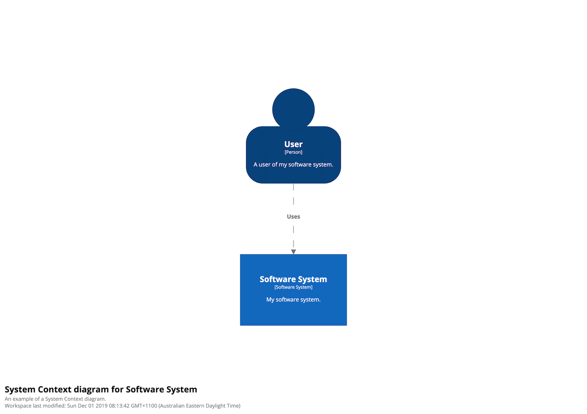
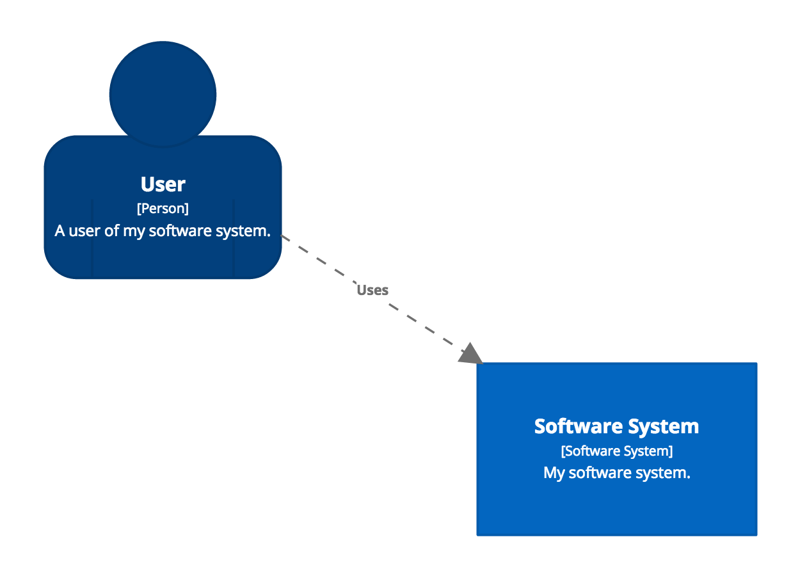
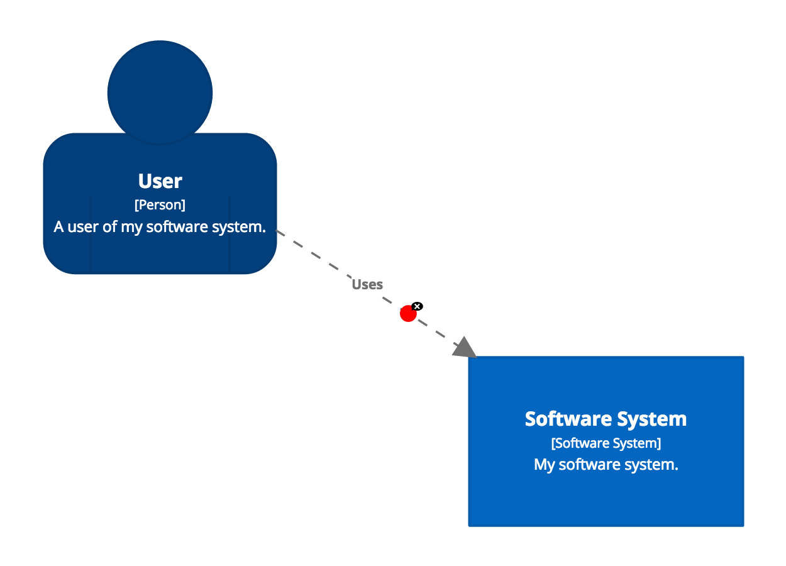
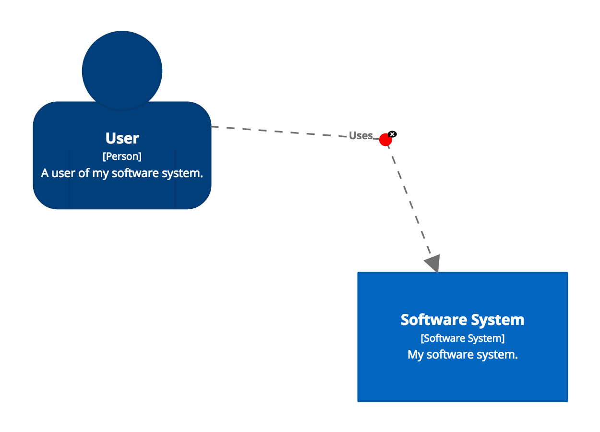

# Diagram editor

The layout of a diagram can modified using the browser-based diagram editor,
by clicking the  button when viewing a diagram,
or using the embedded diagram editor when using the browser-based DSL editor. Please note:

- The diagram editor only provides a way to modify the diagram layout, not the content itself.
- You will need to have owner/admin/read-write access to the workspace to edit the diagram layout.
- You will not be able to modify the diagram layout if [automatic layout](/ui/diagrams/automatic-layout) is enabled.

## Diagram layout

By default, Structurizr does not auto-layout your diagram elements, and you have several options.

|  |  |

### 1. Manual layout (recommended)

The diagram layout can be modified by dragging the elements around the diagram canvas in the diagram editor,
and the layout saved using the "Save workspace" button.
This is the recommended approach, because manual layout allows you to precisely position elements where you want them,
consistently across multiple diagrams.

### 2. Auto-layout

Clicking the  button will open the auto-layout modal.

## Canvas size

A number of pre-defined canvas sizes are available from the dropdown list (A5 portrait, landscape, etc).
Alternatively, you can use the following buttons to use a custom canvas size.

-  Decrease canvas size.
-  Auto canvas size.
-  Increase canvas size.

By default, the diagram will stay centred when using the decrease and increase canvas size buttons.
To disable this, hold the `Alt` key while clicking the button.

## Elements

There are a number of toolbar buttons that become enabled when you multi-select elements, which you can do by holding
the `Alt` or `Shift` key while clicking an element, or by using the lasso tool.
The following buttons allow you to align all selected elements with reference to the first element that was selected.

-  Align selected elements left.
-  Align selected elements centre.
-  Align selected elements right.
-  Align selected elements top.
-  Align selected elements middle.
-  Align selected elements bottom.

You can also horizontally and vertically centre the selected elements on the diagram canvas.

-  Centre diagram or selected elements.

Finally, selected elements can be evenly distributed using the following buttons.

-  Distribute selected elements horizontally.
-  Distribute selected elements vertically.

## Relationships

By default, all links between elements are straight lines.
You can add vertices onto a link by clicking the mouse on the link.
The vertex can be moved by dragging the coloured circle, and removed by clicking the cross.

|  |  | 

Moving the mouse cursor over a link will highlight that link.
While highlighted, the `Up` arrow and `Down` arrow keys can be used to move the positioning of the label,
while the `r` key will toggle the routing algorithm between direct, orthogonal, and curved.