# Notation

Unlike formal diagramming notations such as UML and ArchiMate,
Structurizr purposely uses a very simple and constrained notation consisting of boxes and unidirectional arrows,
some aspects of which can be customised via a set of element and relationship styles.
Any styles that you use are shown on an automatically generated diagram key.

While viewing a diagram, click the  button to show the diagram key.

## Tags and styles

All elements and relationships within a software architecture model can have one or more tags associated with them.
A tag is simply a free-format string. By default, the following tags are associated with elements and relationships.

- Person: `Element` and `Person`
- Software System: `Element` and `Software System`
- Container: `Element` and `Container`
- Component: `Element` and `Component`
- Deployment Node: `Element` and `Deployment Node`
- Infrastructure Node: `Element` and `Infrastructure Node`
- Software System Instance: `Element`, `Software System`, and `Software System Instance`
- Container Instance: `Element`, `Container`, and `Container Instance`
- Relationship: `Relationship`

These default tags cannot be removed, but additional tags can be associated with any element
(except groups/boundaries) or relationship.

Element and relationship styles are associated with a single tag.
For example, to render all people as "Person" shapes on the diagrams, you need to create an element style for the
`Person` tag, and specify a shape of `Person`.

As with CSS, styles cascade according to the order in which they are added. For example, you could create an element
style for the Element tag, in which you specify some defaults, and then create another element style
for the Software System tag to override one or more of those defaults.

The DSL cookcook has entries covering [element styles](/dsl/cookbook/element-styles/)
and [relationship styles](/dsl/cookbook/relationship-styles/).

## Elements

The following aspects of element notation can be changed, via element styles associated with tags.

|                                                                                                                                                                                  | Person	 | Software System  | Container  | Component | Deployment Node	 | Infrastructure Node | Boundary | Group |
|----------------------------------------------------------------------------------------------------------------------------------------------------------------------------------|---------|------------------|------------|-----------|------------------|---------------------|----------|-------|
| Shape (default="Box")                                                                                                                                                       | Yes     | Yes              | Yes        | Yes       |                  | Yes                 |          |       |
| Icon (a data URI representing a base64 encoded PNG/JPG file, or a HTTPS URL to a PNG/JPG file; SVG icons are not supported; please see the note about HTTPS and CORS below) | Yes     | Yes              | Yes        | Yes       | Yes              | Yes                 | Yes      | Yes   |
| Width (pixels; default=450)                                                                                                                                                 | Yes     | Yes              | Yes        | Yes       |                  | Yes                 |          |       |
| Height (pixels; default=300)                                                                                                                                                | Yes     | Yes              | Yes        | Yes       |                  | Yes                 |          |       |
| Background colour (HTML hex value; default="#dddddd")                                                                                                                       | Yes     | Yes              | Yes        | Yes       | Yes              | Yes                 | Yes      | Yes   |
| Stroke color (HTML hex value; default=a darker version of the element background)                                                                                           | Yes     | Yes              | Yes        | Yes       | Yes              | Yes                 | Yes      | Yes   |
| Stroke width (pixels, 1-10; default=2)                                                                                                                                      | Yes     | Yes              | Yes        | Yes       | Yes              | Yes                 | Yes      | Yes   |
| Text colour (HTML hex value; default="#000000")                                                                                                                             | Yes     | Yes              | Yes        | Yes       | Yes              | Yes                 | Yes      | Yes   |
| Font size (pixels; default=24)                                                                                                                                              | Yes     | Yes              | Yes        | Yes       | Yes              | Yes                 | Yes      | Yes   |
| Border ("Solid", "Dashed", or "Dotted"; default="Solid")                                                                                                                    | Yes     | Yes              | Yes        | Yes       | Yes              | Yes                 |          |       |
| Opacity (an integer between 0 and 100; default=100)                                                                                                                         | Yes     | Yes              | Yes        | Yes       | Yes              | Yes                 | Yes      | Yes   |
| Metadata (true or false, to show or hide the metadata)                                                                                                                      | Yes     | Yes              | Yes        | Yes       | Yes              | Yes                 | Yes      |       |
| Description (true or false, to show or hide the description)                                                                                                                | Yes     | Yes              | Yes        | Yes       |                  | Yes                 |          |       |

### Shapes

Using different shapes can be a great way to add an additional level of information to specific elements, as well as
making a diagram look more aesthetically pleasing. Structurizr provides a number of different shapes that you can use
to style your diagram elements.

| 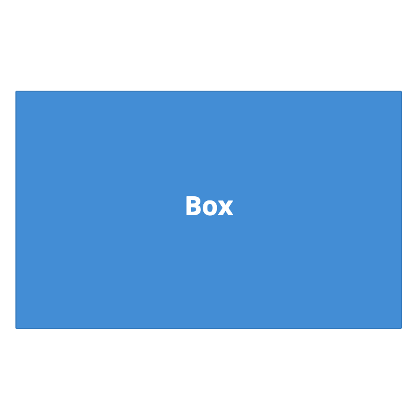 | 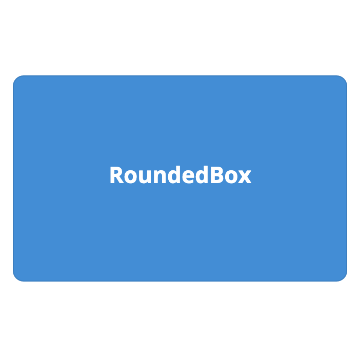 | 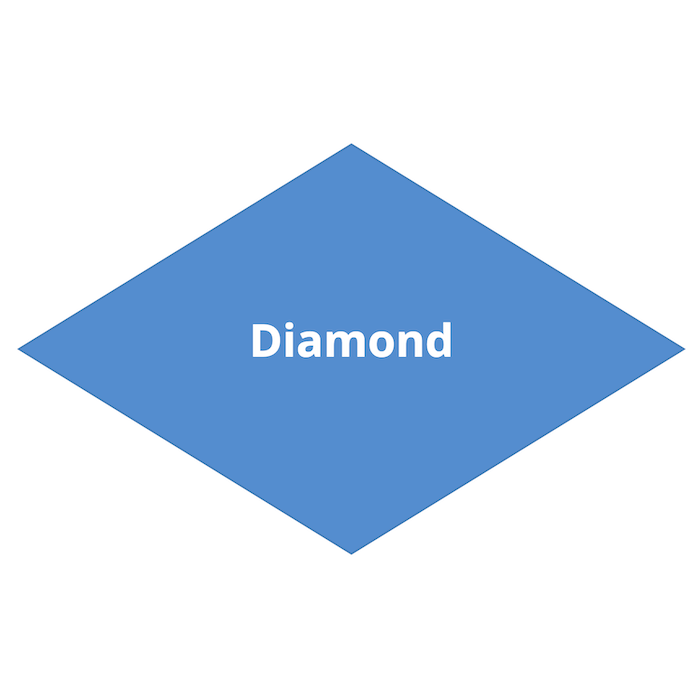 | 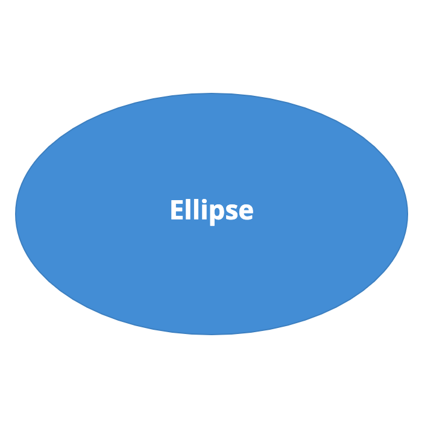 |
| 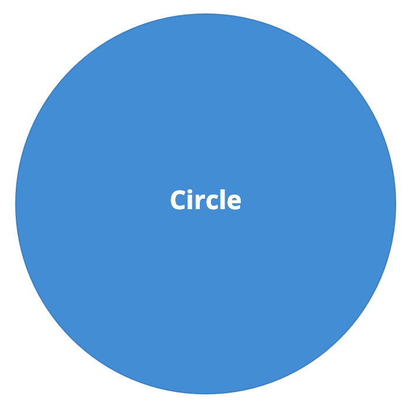 | 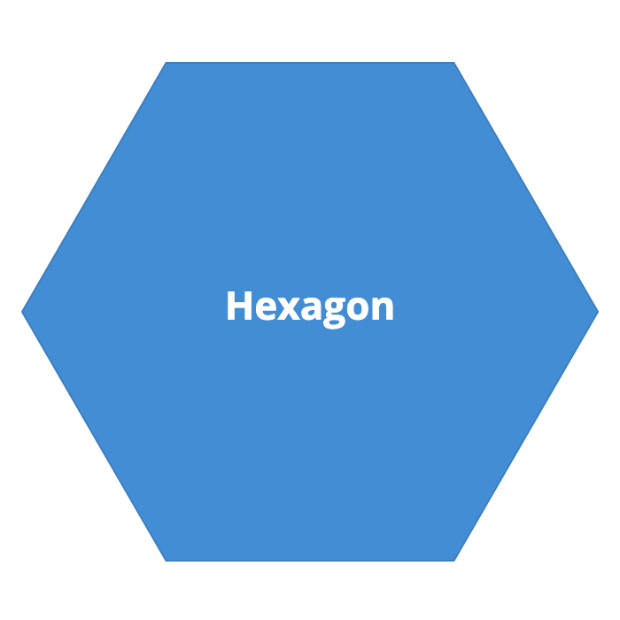 | 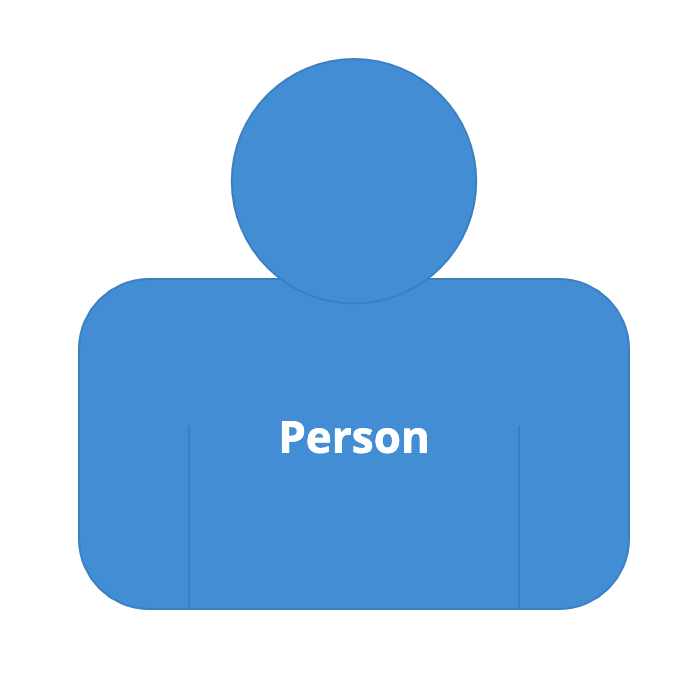 | 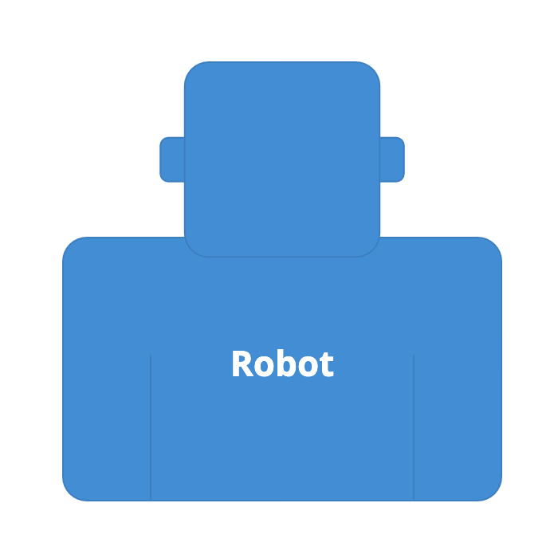 |
|  | 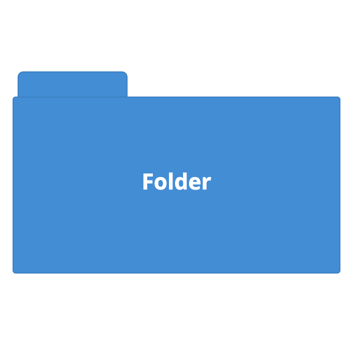 |  | 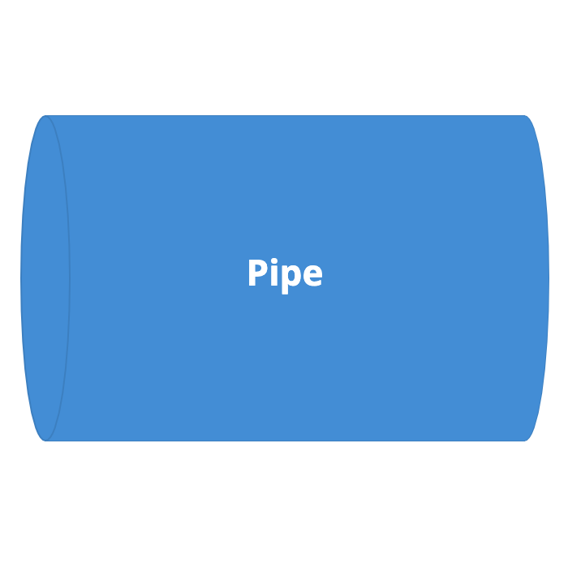 |
|  | 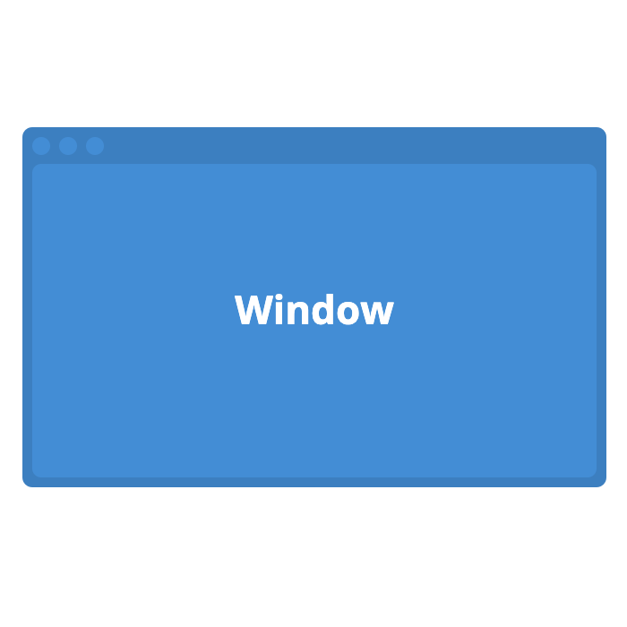 |  |  |

## Relationships

A relationship between two elements is illustrated by unidirectional (one-way) arrow as follows.
Bidirectional (two-way) arrows are not recommended because they are ambiguous, and are not supported by Structurizr.

| 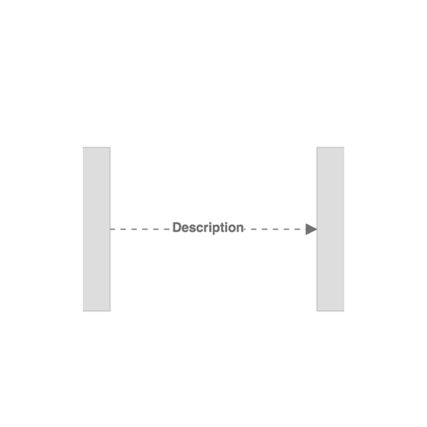 | 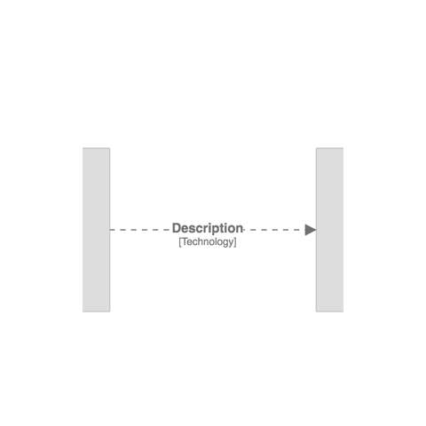 |

Again, some aspects of this notation can be changed.

- Line thickness (pixels; default=2)
- Colour (HTML hex value; default="#707070")
- Style ("Solid", "Dashed", "Dotted"; default="Dashed")
- Routing ("Direct", "Curved", or "Orthogonal"; default="Direct")
- Font size (pixels; default=24)
- Width (of the description block, in pixels; default=200)
- Position (of the description along the line, as a percentage from start to end; default=50)
- Opacity (an integer between 0 and 100; default=100)

## Boundaries and groups

A number of diagram types may include boundaries to group elements, as follows:

| View type        | Boundaries included                                                                                                                  | Groups included                                                                                                                       |
|------------------|--------------------------------------------------------------------------------------------------------------------------------------|---------------------------------------------------------------------------------------------------------------------------------------|
| System landscape | Enterprise (deprecated, use groups instead)                                                                                          | Software systems, people, custom elements                                                                                             |
| System context   | Enterprise (deprecated, use groups instead)                                                                                          | Software systems, people, custom elements                                                                                             |
| Container        | Software systems                                                                                                                     | 	Containers                                                                                                                           |
| Component        | Containers (and optionally software systems with `structurizr.softwareSystemBoundaries` set to true)                                 | Components                                                                                                                            |
| Dynamic          | Unscoped: same as system landscape Software system scoped: same as container view Container scoped: same as component view | Unscoped: same as system landscape Software system scoped: same as container view Container scoped: same as component view  |
| Deployment       | None                                                                                                                                 | None                                                                                                                                  |                                                                                                                             

The following styles are applied to these boundaries by default:

- Enterprise boundary: dark grey (`#444444`)
- Group: dark grey (`#444444`)
- Software system boundary: the border colour (stroke colour) of the software system
- Container boundary: the border colour (stroke colour) of the container

Boundaries can be customised with element styles and the following tags:

- `Boundary` - all enterprise/software system/container boundaries
- `Boundary:Enterprise` - the enterprise boundary only (deprecated)
- `Boundary:SoftwareSystem` - all software system boundaries
- `Boundary:Container` - all container boundaries
- `Group` - all groups
- `Group:Name` - the named group only

## Icons

Icons can be defined in element styles (both in a workspace, or via a theme), for rendering on elements and groups,
as shown in the example below.

### Supported formats

The supported image formats are PNG, JPG, and SVG; specified using a URL or a base64 encoded data URI. When referencing images from a URL, if you are using the cloud service or an on-premises installation via HTTPS, the image must be served over HTTPS too.

### Potential issues

There are two potential issues that you may encounter when using icons/images:

1. Images don't render (you may see errors in your web browser's developer console about images being blocked)
2. Diagrams fail to export to PNG/SVG formats (you may see errors in your web browser's developer console about the canvas being "tainted")

Both of these problems are generally caused by your web browser blocking access to the images due to the restrictions
associated with [Cross-Origin Resource Sharing (CORS)](https://developer.mozilla.org/en-US/docs/Web/HTTP/CORS).
For this reason, the web server hosting your image must set the
`Access-Control-Allow-Origin` header to allow cross-origin requests.
See [Allowing cross-origin use of images and canvas](https://developer.mozilla.org/en-US/docs/Web/HTML/CORS_enabled_image) for more details.

To avoid these problems, you can alternatively specify your icons as a base64 data URI instead. You can find utilities to convert an image file to a base64 encoded data URI in the Structurizr client libraries, and online.

## Terminology

By default, Structurizr uses the terminology defined by the [C4 model](https://c4model.com) when rendering elements on diagrams.
Specifically, the following terminology is used:

- Person
- Software System
- Container
- Component
- Deployment Node
- Infrastructure Node
- Relationship

This terminology can be changed (e.g. via the DSL [terminology](/dsl/language#terminology) keyword,
providing a way for the terminology on diagrams to be modified (e.g. language translations).