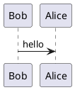

# Images

Images can be included using the regular Markdown/AsciiDoc syntax.

- Markdown: ``
- AsciiDoc: `image::url|path[alt]`

For this to work, the image files must be hosted externally (e.g. on your own web server, and accessible via a HTTPS URL)
or embedded within your workspace.

## PlantUML and Mermaid diagrams

At this time, the Structurizr documentation renderer does not natively support diagramming formats such as PlantUML or Mermaid.
In other words, it's not possible to embed PlantUML diagram source into Markdown/AsciiDoc content,
and have it rendered automatically.
You can, however, pre-process your Markdown/AsciiDoc content before uploading your workspace (or rendering it with Structurizr Lite),
to convert any PlantUML diagram definitions to regular image tags.

For example, consider the following PlantUML definition:

This could be converted to the following image:

Markdown: ``
AsciiDoc: `image::https://www.plantuml.com/plantuml/svg/SoWkIImgAStDuNBAJrBGjLDmpCbCJbMmKiX8pSd9vt98pKi1IW80[]`

See [PlantUMLEncoderPlugin](https://github.com/structurizr/examples/tree/main/dsl/plantuml-and-mermaid/plugin/src/main/java/plantuml) for an example DSL plugin.