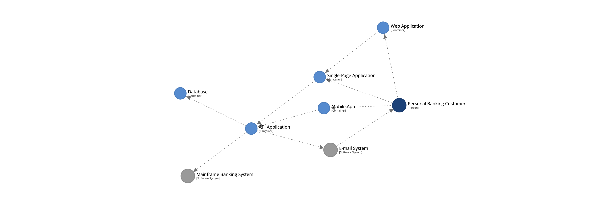
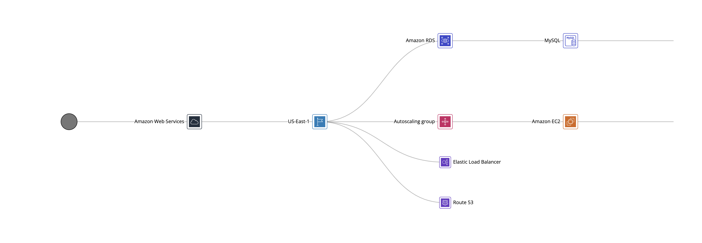

# Explorations

A number of additional visualisations are available, which allow you to explore the structure of the underlying software architecture model.

To access them, click the  button while viewing a diagram.

