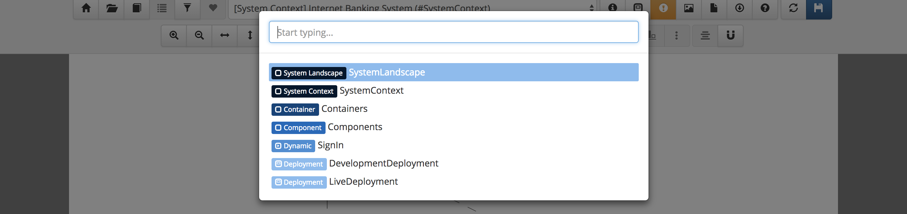
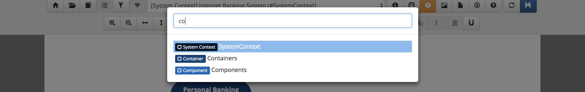
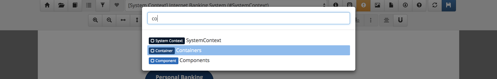

# Quick navigation

Structurizr includes a quick navigation feature, which allows you to use your keyboard to easily find and navigate to an item.
While viewing your dashboard, workspace summary, diagrams, documentation or decision log, press the `Space` key to activate the quick navigation feature.

Start typing to quickly find the item that you would like to navigate to.

You can use the `up` and `down` cursor keys to change the selected item, and press `Enter` to navigate to that item.
Alternatively, you can click an item with the mouse.

