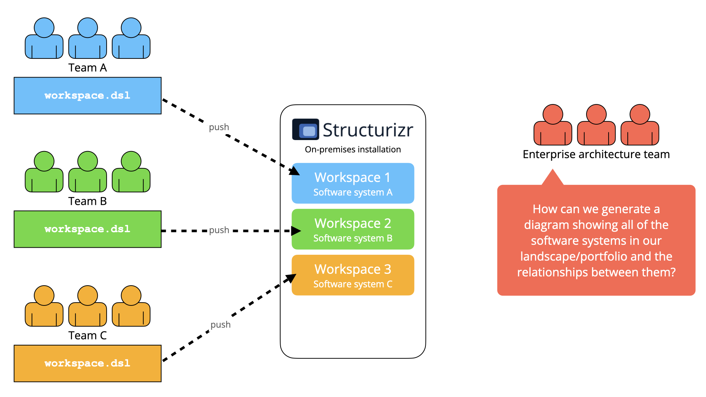
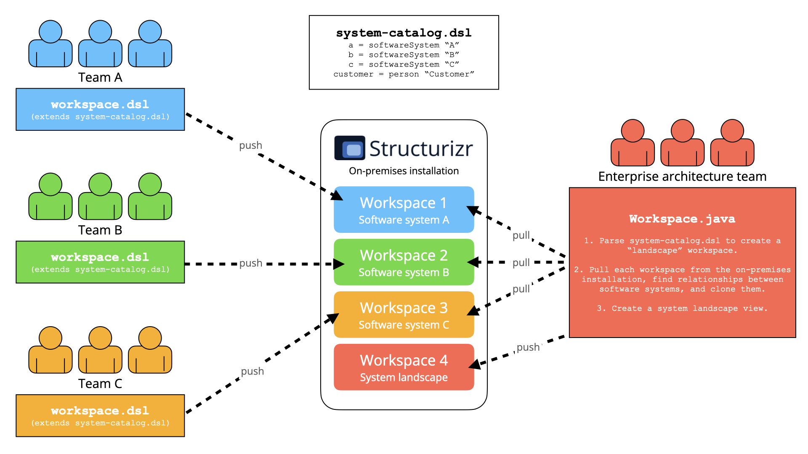

# Enterprise

Usage across an entire enterprise tends to stem from one of the following scenarios:

- __Top-down__: The organisation has made a conscious decision to adopt the C4 model and the Structurizr tooling, and are mandating usage by all teams.
- __Bottom-up__: One or more teams have found the C4 model and Structurizr useful, and want to spread adoption across more teams.

Irrespective of how the tooling is introduced, you will likely come across one or both of the following scenarios at
some point:

1. Each team is modelling their own software systems, but they are all using shared software systems/services such as authentication. How do we ensure consistency (e.g. naming) across all teams?
2. Each team is modelling their own software systems, which will include the relationships to other software systems owned by other teams. Decentralised workspace authoring works well, but an organisation would still like a centralised landscape view across the enterprise.

One potential solution to this problem is to create a single workspace that covers the entire enterprise, assembled
by asking individual teams to provide only their part of the software architecture model. 
If using the Structurizr DSL, you might create a single workspace that uses the `!include` keyword to include the DSL
fragment provided by each team. This can work across a small number of teams, but rapidly breaks down at scale.

A better approach is as follows:

1. Create a single shared "system catalog" workspace that defines all the people and software systems across all teams.
2. Ask each team to [extend](/dsl/workspace-extension) this system catalog workspace, and add detail to describe their software system via the [!element](/dsl/language#element-1) keyword.
3. Ask each team to publish their workspace to a single on-premises installation.
4. Automatically generate a landscape workspace by aggregating all the software systems, people, and relationships from all published workspaces.

There are several implementation strategies for achieving this, which will covered on the
[Structurizr Patreon](https://patreon.com/structurizr) in the coming weeks.

|---|---|
|  |  |

