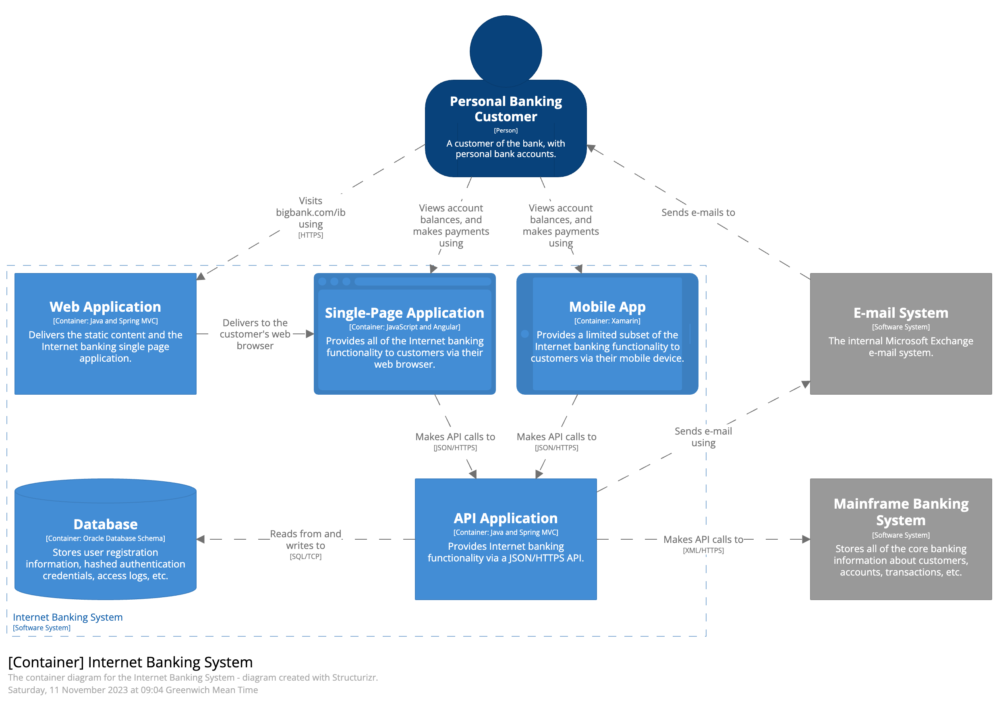
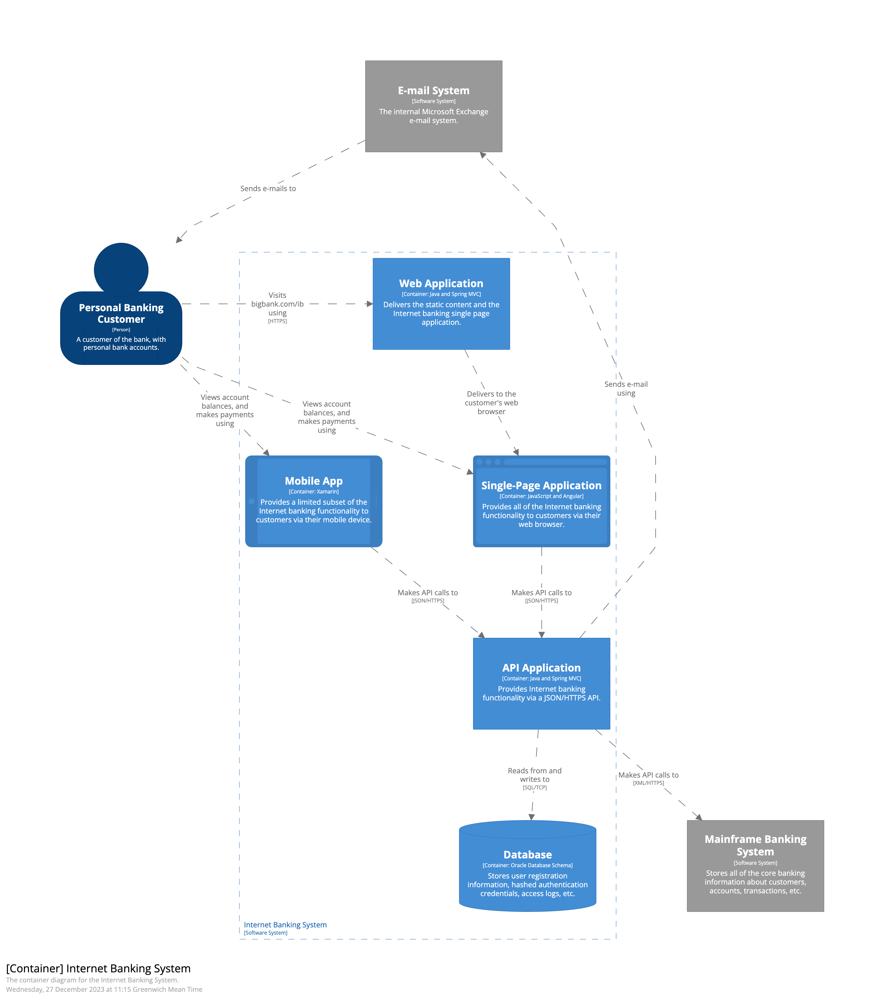
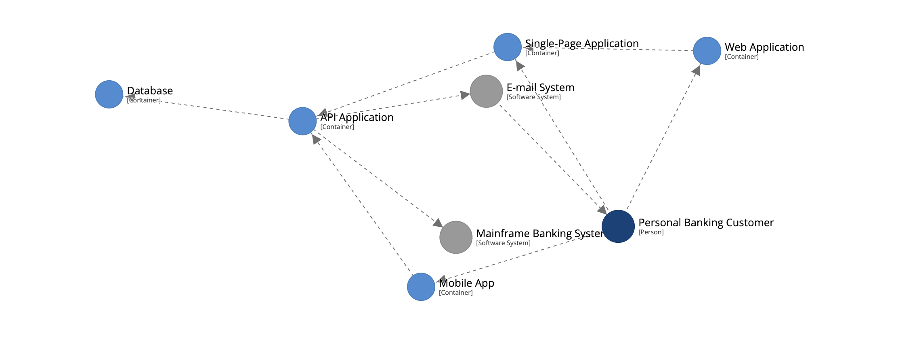
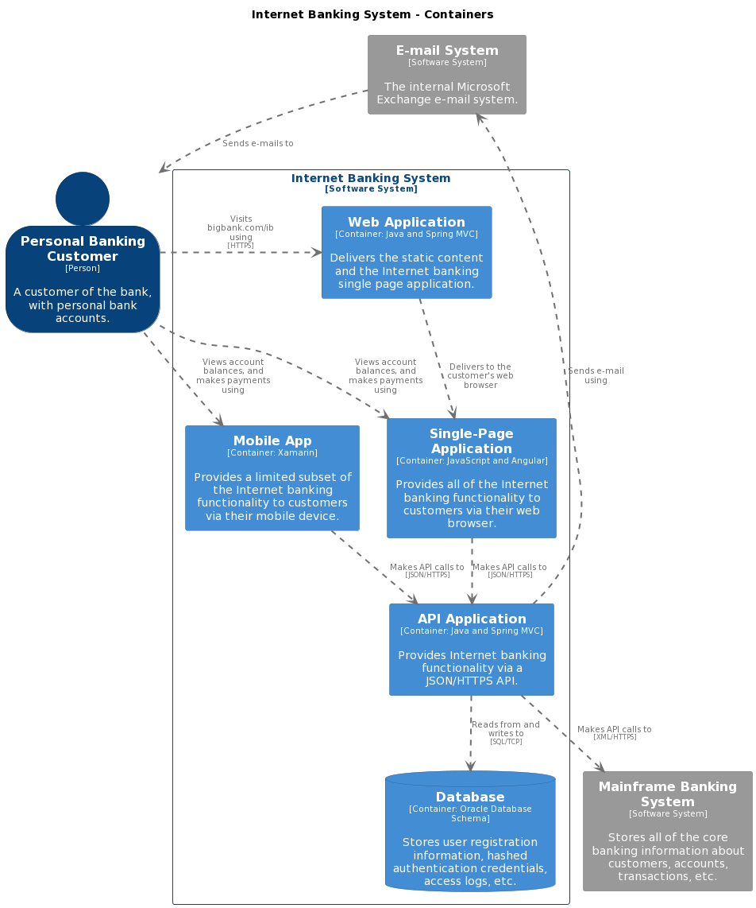
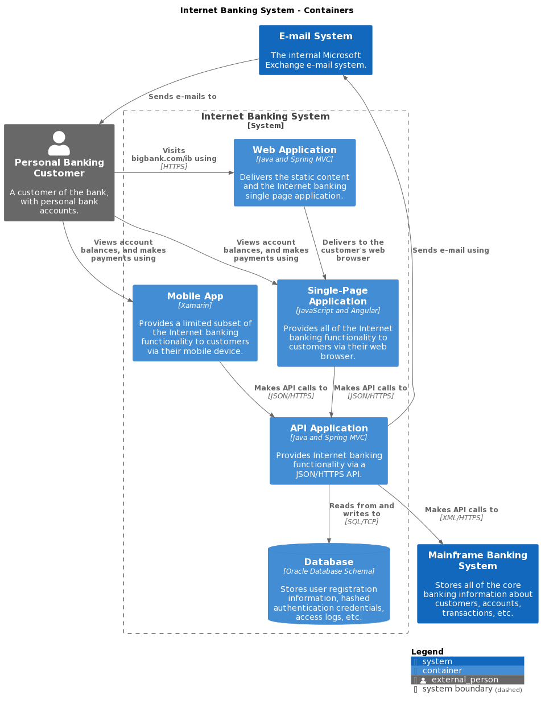
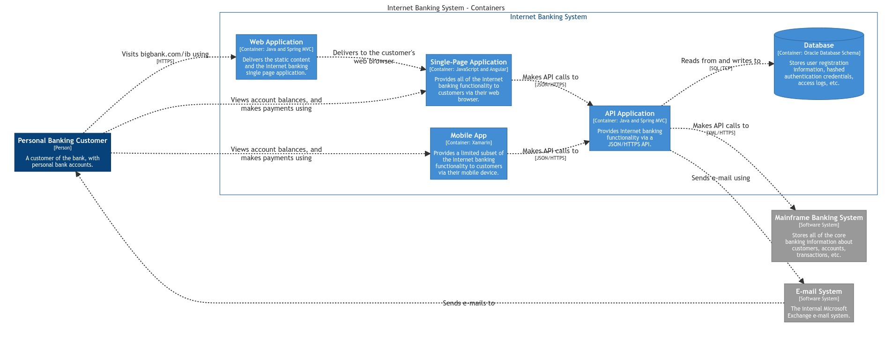
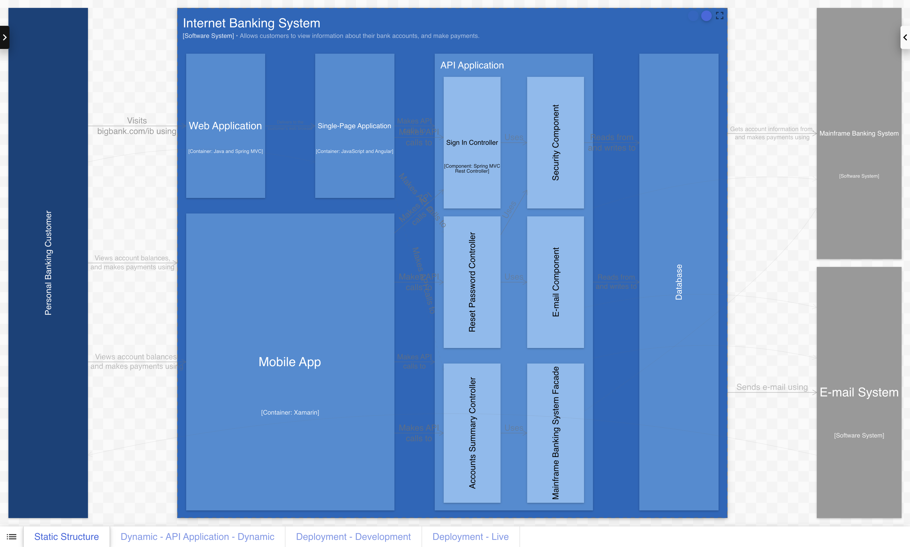

# Rendering

Unlike most modelling tools, and because of the open JSON data format, Structurizr is rendering tool independent.
For example, here are a number of visualisations of the same model/views.

|-----------------------------------------------------------------------------------------------|-------------------------------------------------------------------------------------------------------------------------------------------------------------------------------|
| Structurizr cloud service, on-premises installation, and Lite - diagram with manual layout    |                                  |
| Structurizr cloud service, on-premises installation, and Lite - diagram with automatic layout |  |
| Structurizr cloud service, on-premises installation, and Lite - graph (interactive layout)    |                                        |
| PlantUML via the Structurizr CLI (automatic layout only)                                      |                                 |
| C4-PlantUML via the Structurizr CLI (automatic layout only)                                   |                          |
| Mermaid via the Structurizr CLI (automatic layout only)                                       |                                    |
| Ilograph via the Structurizr CLI (interactive layout)                                         |                                 |

## Tooling

There are three basic categories of rendering tools:

- __Structurizr Lite/on-premises installation/cloud service__: These are the "original" browser-based rendering tools and support the largest feature set. See [Products](/products) for an overview of the different intended use cases and features.
- __PlantUML, Mermaid, D2, WebSequenceDiagrams, Ilograph, etc__ via the __Structurizr CLI__: These "export" formats provide a wide range of compatability with existing tools. See [Exporters - Comparison](/export/comparison) for a comparison of the formats and features.
- __Community tools__: These embed the browser-based UI from Structurizr Lite, etc or the export formats to provide a different tooling experience. See [Community tooling - Rendering tools](/community#rendering-tools) for a full list.

If you have Docker or Java installed, the easiest tool to get started with is Structurizr Lite, which is designed to be
used primarily for a quick roundtrip experience when authoring workspaces via the Structurizr DSL.
See [Structurizr Lite - Quickstart](/lite/quickstart) for more details.